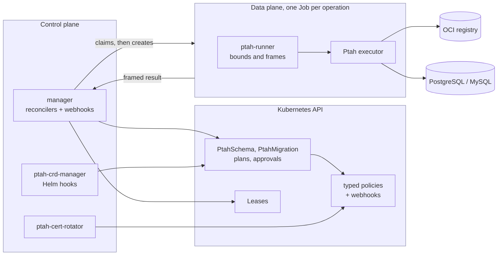

This page describes the operator's components, where they live, and the
constraints a change has to preserve. For using the operator rather than
changing it, start from [Operations](../../use/operations/).

One rule generates most of the rest: **the controller never touches a
database, and the process that touches a database never holds a Kubernetes
credential.** Almost every boundary below is that rule being enforced
somewhere.

## What a deployment looks like {#deployment-scope}

Before the components: the shape a platform owner has to plan for, and where
to look when something is wrong. Each row is argued for further down the page.

| Question | Answer |
| --- | --- |
| How many installations per cluster? | Exactly one. The admission configurations are a fixed singleton, so a second release is refused rather than sharing them. |
| What does the manager watch? | Every namespace. It is a cluster-scoped controller over namespaced resources. |
| How is it made available? | Replicas within that one release. One is the active reconciler through a leader-election Lease; every ready replica serves the webhooks. |
| What contends with what? | Every resource addressing one database, whatever namespace it is in. They take turns through a Lease in one configurable coordination namespace. |
| What touches a database? | Only a Job, one per operation, in the resource's own namespace. The manager never opens a database connection. |
| What holds Kubernetes credentials? | Only the control plane. An operation Pod is given a database credential and no Kubernetes one, which is the rule the rest of this page enforces. |
| What stops SQL nobody approved? | For each family, a named enforcement point: [Execution guarantees](../guarantees/). |
| Where do I look when an Apply is uncertain? | The resource's own status, and [A migration run nobody accounted for](../../use/operations/#a-migration-run-nobody-accounted-for) for the family that cannot resolve it alone. |

The failure domains that follow from those answers are not the same size.
Losing a manager replica costs a reconciler and no availability. Losing the
release costs reconciliation for the whole cluster, while every database keeps
whatever the last Apply left it holding. Losing a database costs the resources
bound to it and nothing else: the operator's own state lives in Kubernetes.

## Words this page uses {#words-this-page-uses}

Five of them are this project's rather than Kubernetes's, and the diagram below
uses all five. Each links to the section that goes into it.

| Term | What it is | Where it lives |
| --- | --- | --- |
| Operation claim | One unit of work a controller has decided to do -- its type, a deterministic id, the inputs it was computed from, and the Job it will dispatch. Persisted before the Job exists, so a restart finds the claim rather than a Job nobody expected. | `status.activeOperation`; [One operation, end to end](../execution/#one-operation-end-to-end) |
| Result frame | The structured envelope a runner writes to stdout: the protocol version, the operation it answers, its id, the child's exit code, and whatever that operation produced. The controller reads the frame, never the child's own output. | `internal/runner`, `runner.ProtocolVersion`; [One operation, end to end](../execution/#one-operation-end-to-end) |
| Realm | The set of resources that can mutate one physical database, whatever URL each of them uses to reach it. | [Concurrency and coordination](../execution/#concurrency-and-coordination) |
| Post-Apply verification | Reading the database back after a mutation to confirm what it did, as distinct from what the run claimed. | [The schema lifecycle](../reconciliation/#the-schema-lifecycle), [The migration lifecycle](../reconciliation/#the-migration-lifecycle) |
| Protected table | A table a verification policy refuses to let a plan change, by name. Refusal happens where the plan is computed, so no SQL is produced for it. | `protectedTables`; [Declarative reference data](../plans-and-approvals/#declarative-reference-data) |

### Four identities, and what invalidates each {#four-identities}

They are easy to read as interchangeable evidence and they are not. Each
answers a different question, and each is invalidated by a different event.

| Identity | Answers | Invalidated by |
| --- | --- | --- |
| Coordination identity | Which realm a resource claims -- derived from `spec.target.engine` and `spec.target.coordinationKey`, and from nothing a credential carries | Editing either field, which moves the resource to another realm |
| Target identity | Which database a run actually reached, derived by the Pod from the URL it resolved | The URL resolving somewhere else: another host, port or database |
| Lease epoch | Which uninterrupted interval of realm ownership a claim holds | The Lease lapsing and being acquired again, which loses continuity and discards any result produced across the change |
| Execution binding epoch | Which set of execution components a plan was computed under -- manager image and revision, controller-state version, Ptah version, executor and runner images, runner protocol | Any one of those components changing, which retires the plans computed under the old set |

The first two are about *where*: one is configured, the other is observed, and
a plan binds both so a redirect between planning and applying is refused. The
last two are about *when*: one bounds a lock, the other bounds a build.

## The shape of the system

The manager decides and records. It creates Jobs, and it reads back a framed
result. It holds no database credential and has no permission to read the
Secret that carries one.

Five programs ship from `cmd/`:

| Program | What it is |
| --- | --- |
| `manager` | The reconcilers for both resource families, plus the admission webhook server |
| `ptah-runner` | Runs inside every operation Pod: validates inputs, bounds output, redacts credentials, frames the result |
| `ptah-cert-rotator` | Issues and replaces the webhook serving certificates |
| `ptah-crd-manager` | The Helm hooks: install preflight, CRD reconcile, upgrade retirement, uninstall teardown |
| `kubectl-ptah` | A read-only plugin that reconstructs a published plan for a person to read |

### What the manager keeps in memory

A watch is a cache, and a cache holds whole objects. The manager watches both
resource families, their plans and approvals, the Jobs it owns, and -- across
every namespace -- ConfigMaps, because a changed verification policy has to
wake the resources bound to it.

That last watch is the one whose size nobody chooses. It would otherwise hold
every application ConfigMap in the cluster and this operator's own plan chunks,
which carry up to 8 MiB of SQL each; forty published plans is 320 MiB of cached
payload against a manager whose default limit is 256 MiB. So the cache empties
a ConfigMap as it stores it, keeping the metadata that names it and dropping
its data, its binary data and the managed fields that describe them.

Nothing reads those emptied objects. Every ConfigMap this operator acts on --
a verification policy, a plan chunk -- is read straight from the API server,
because each is a decision a cache may not be current enough to make, and the
manager's client routes ConfigMap reads there as well so that a read added
later cannot quietly start seeing an emptied object or build a second cache
holding what the first one dropped.

## The two resource families

`PtahSchema` answers "what should the database look like?". It observes, plans
against what it found, and converges — including the reference rows a
declaration names.

`PtahMigration` answers "which ordered versions have run?". It reads the
recorded history, selects the pending sequence, and executes it in order.

Each family is three kinds: the resource a person writes, the immutable plan
the controller publishes, and the immutable approval a person creates to
authorize exactly that plan.

| Family | Desired state | Published plan | Decision |
| --- | --- | --- | --- |
| Declared schema | `PtahSchema` | `PtahSchemaPlan` | `PtahSchemaApproval` |
| Versioned migrations | `PtahMigration` | `PtahMigrationPlan` | `PtahMigrationApproval` |

The manager reconciles the two desired-state kinds, watches the two approval
kinds, and watches the verification-policy ConfigMaps resources point at, so an
edited policy is noticed rather than waited out. It does not watch the plan
kinds: it writes them, and a plan it wrote tells it nothing it did not already
know.

The two families are separate kinds rather than modes of one, because their
evidence differs: a schema plan binds an observed state and a desired state,
and a migration plan binds a version sequence, per-migration checksums and the
history it was computed against. One kind carrying both would make every field
conditional on which controller wrote it, and would make approval and status
ambiguous.

What they genuinely share is the mechanism, not the model: OCI tag resolution
and digest pinning (`internal/ocireference`), registry authentication and
custom transport trust, artifact verification and type enforcement
(`internal/policy`), Job construction (one `workload.Builder`), result framing
(`internal/runner`), coordination realms and Leases (`internal/targetlock`),
and the route identity guard.

## Where the rest of it is

This page is the shape. Each contract has one home, and the page that owns it
is the one to change when the contract changes.

| Page | Owns |
| --- | --- |
| [Reconciliation](../reconciliation/) | Both lifecycles, phase by phase: what each operation is for, what blocks, what suspends |
| [Execution and coordination](../execution/) | One operation from claim to evidence, the durable claims, and how two resources share a database |
| [Plans and approvals](../plans-and-approvals/) | What a plan binds, how its bytes are stored, what a decision authorizes, and declared rows |
| [Credentials and admission](../credentials-and-admission/) | Which process holds which credential, and what the admission contract refuses |
| [Release lifecycle](../release-lifecycle/) | Install, upgrade, retirement and uninstall, and the certificate handoffs inside them |
| [Execution guarantees](../guarantees/) | Each promise mapped to the enforcement point in each family, and the test that proves it |

## Where the code lives

| Concept | Package |
| --- | --- |
| Reconcilers for both families | `internal/controller` |
| Bounded Job and Pod construction | `internal/workload` |
| Result framing, redaction, input validation | `internal/runner` |
| Machine-readable data-plane contracts | `internal/dataplane` |
| Canonical content identities | `internal/fingerprint` |
| Plan publication into immutable chunks | `internal/planstore` |
| Plan byte-size contract | `internal/plancontract` |
| Migration plan derivation and naming | `internal/migrationplan` |
| Approval admission | `internal/admission` |
| The manager's own write guard | `internal/controllerwrite` |
| Pod admission snapshots | `internal/podintent` |
| Verification policy binding | `internal/policy` |
| OCI reference parsing and pinning | `internal/ocireference` |
| Database realm Leases | `internal/targetlock` |
| Durable manager-state contract | `internal/controllerstate` |
| Certificate lifecycle | `internal/certrotation` |
| CRD, RBAC and release lifecycle | `internal/crdupgrade` |
| Read-only views behind `kubectl ptah` | `internal/planview`, `internal/schemaview`, `internal/migrationview` |
| Bounded-cardinality metrics | `internal/telemetry` |
| What the manager caches from a watch | `internal/managercache` |

## How this is proven

Unit tests and envtest measure this code and the API contract. They do not
measure what Kubernetes would do: envtest runs no built-in controllers, so
nothing there reconciles a Deployment into Pods or garbage-collects by owner
reference.

What proves the claims on this page is the acceptance matrix, one job per
supported Kubernetes minor and suite, against kind with a real registry,
PostgreSQL and MySQL. `support/e2e-suites.json` is the single place the suites
and their phases are written down: the lifecycle suite proves install, the CRD
upgrade path and uninstall; certificates proves rotation and recovery from a
corrupt CA; data-plane proves both engines end to end plus restart and fault
injection; and one suite per engine proves versioned migrations and declared
reference data. The strict `Kubernetes support gate` is what says they passed,
and it fails on a skipped job, an incomplete matrix or a missing result rather
than reporting green.
