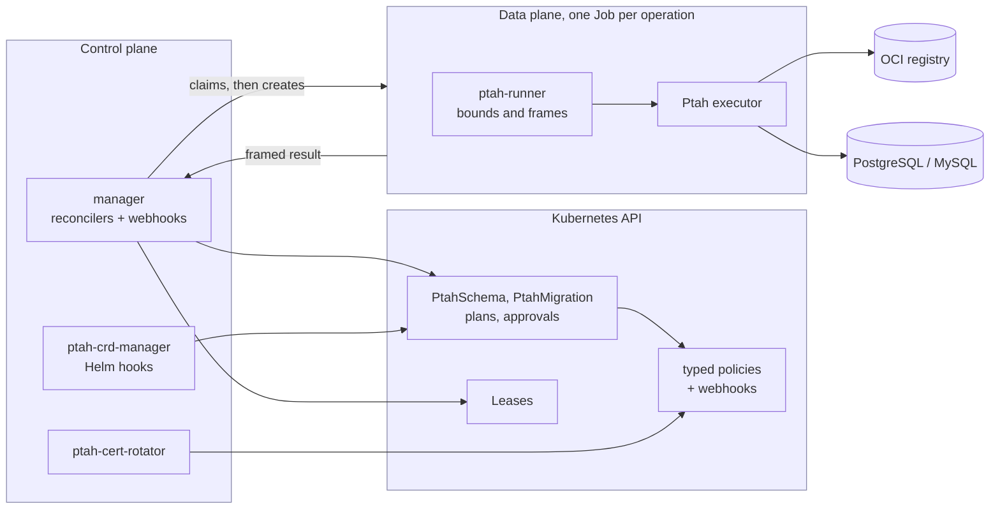
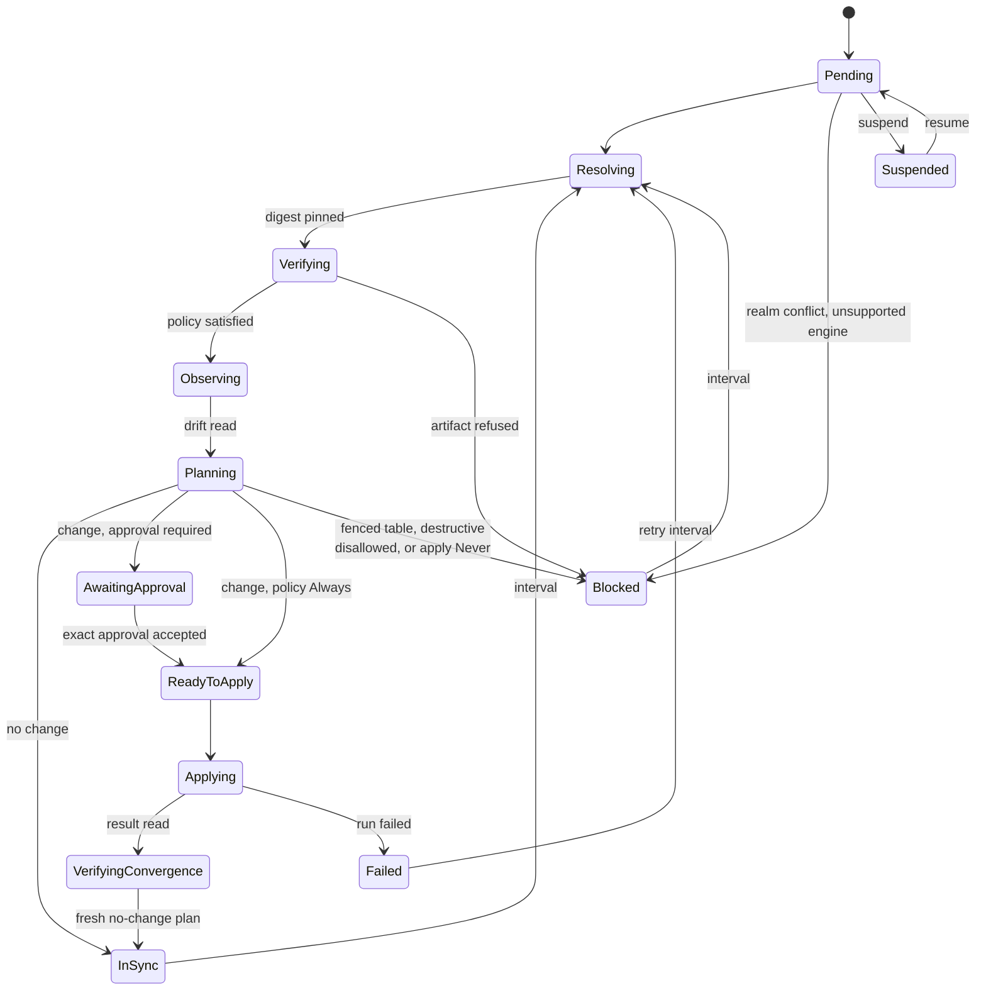
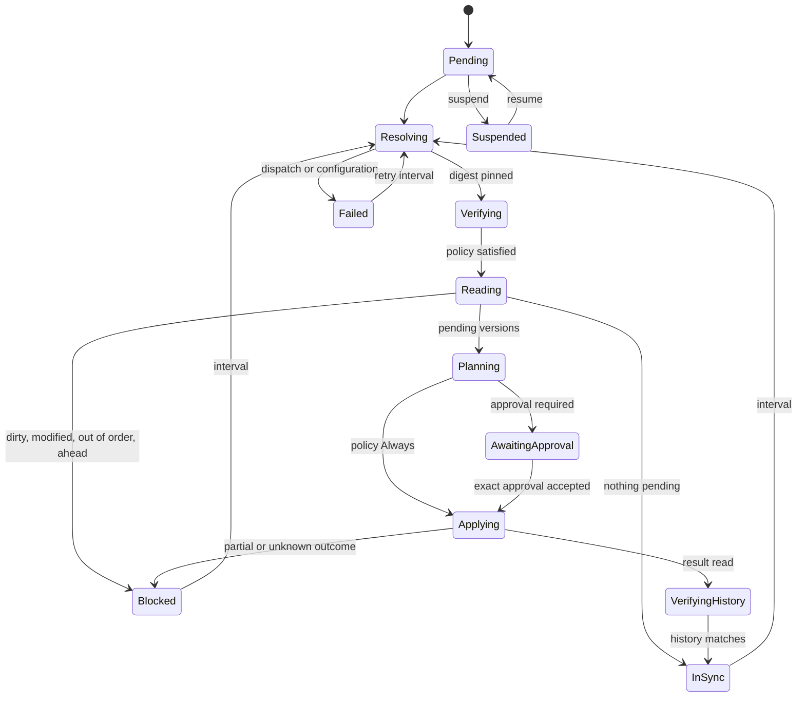
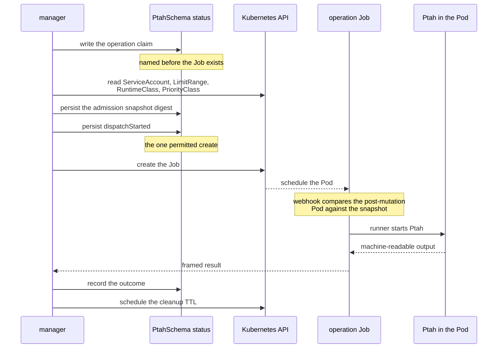
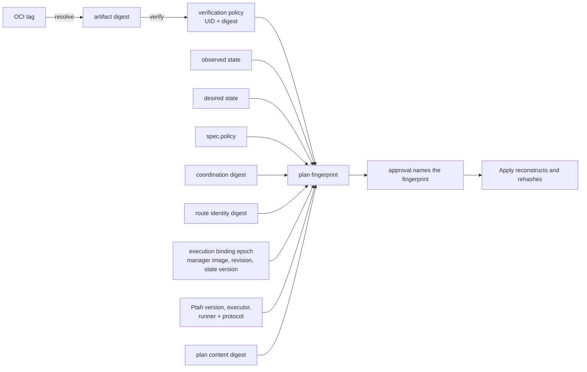

This page is for somebody changing this code. It says what the pieces are,
where they live, and which invariant each one exists to hold. The task pages
say how to use the operator; this one says why it is shaped the way it is.

One rule generates most of the rest: **the controller never touches a
database, and the process that touches a database never holds a Kubernetes
credential.** Almost every boundary below is that rule being enforced
somewhere.

## The shape of the system

The manager decides and records. It creates Jobs, and it reads back a framed
result. It holds no database credential and has no permission to read the
Secret that carries one.

Five programs ship from `cmd/`:

| Program | What it is |
| --- | --- |
| `manager` | The reconcilers for both resource families, plus the admission webhook server |
| `ptah-runner` | Runs inside every operation Pod: validates inputs, bounds output, redacts credentials, frames the result |
| `ptah-cert-rotator` | Issues and replaces the webhook serving certificates without anybody holding a key |
| `ptah-crd-manager` | The Helm hooks: install preflight, CRD reconcile, upgrade retirement, uninstall teardown |
| `kubectl-ptah` | A read-only plugin that reconstructs a published plan for a person to read |

### What the manager keeps in memory

A watch is a cache, and a cache holds whole objects. The manager watches both
resource families, their plans and approvals, the Jobs it owns, and -- across
every namespace -- ConfigMaps, because a changed verification policy has to
wake the resources bound to it.

That last watch is the one whose size nobody chooses. It would otherwise hold
every application ConfigMap in the cluster and this operator's own plan chunks,
which carry up to 8 MiB of SQL each; forty published plans is 320 MiB of cached
payload against a manager whose default limit is 256 MiB. So the cache empties
a ConfigMap as it stores it, keeping the metadata that names it and dropping
its data, its binary data and the managed fields that describe them.

Nothing reads those emptied objects. Every ConfigMap this operator acts on --
a verification policy, a plan chunk -- is read straight from the API server,
because each is a decision a cache may not be current enough to make, and the
manager's client routes ConfigMap reads there as well so that a read added
later cannot quietly start seeing an emptied object or build a second cache
holding what the first one dropped.

## Where the code lives

| Concept | Package |
| --- | --- |
| Reconcilers for both families | `internal/controller` |
| Bounded Job and Pod construction | `internal/workload` |
| Result framing, redaction, input validation | `internal/runner` |
| Machine-readable data-plane contracts | `internal/dataplane` |
| Canonical content identities | `internal/fingerprint` |
| Plan publication into immutable chunks | `internal/planstore` |
| Plan byte-size contract | `internal/plancontract` |
| Migration plan derivation and naming | `internal/migrationplan` |
| Approval admission | `internal/admission` |
| The manager's own write guard | `internal/controllerwrite` |
| Pod admission snapshots | `internal/podintent` |
| Verification policy binding | `internal/policy` |
| OCI reference parsing and pinning | `internal/ocireference` |
| Database realm Leases | `internal/targetlock` |
| Durable manager-state contract | `internal/controllerstate` |
| Certificate lifecycle | `internal/certrotation` |
| CRD, RBAC and release lifecycle | `internal/crdupgrade` |
| Read-only views behind `kubectl ptah` | `internal/planview`, `internal/schemaview`, `internal/migrationview` |
| Bounded-cardinality metrics | `internal/telemetry` |
| What the manager caches from a watch | `internal/managercache` |

## The two resource families

`PtahSchema` answers "what should the database look like?". It observes, plans
against what it found, and converges — including the reference rows a
declaration names.

`PtahMigration` answers "which ordered versions have run?". It reads the
recorded history, selects the pending sequence, and executes it in order.

Each family is three kinds: the resource a person writes, the immutable plan
the controller publishes, and the immutable approval a person creates to
authorize exactly that plan.

| Family | Desired state | Published plan | Decision |
| --- | --- | --- | --- |
| Declared schema | `PtahSchema` | `PtahSchemaPlan` | `PtahSchemaApproval` |
| Versioned migrations | `PtahMigration` | `PtahMigrationPlan` | `PtahMigrationApproval` |

The manager reconciles the two desired-state kinds, watches the two approval
kinds, and watches the verification-policy ConfigMaps resources point at, so an
edited policy is noticed rather than waited out. It does not watch the plan
kinds: it writes them, and a plan it wrote tells it nothing it did not already
know.

The two families are separate kinds rather than modes of one, because their
evidence differs: a schema plan binds an observed state and a desired state,
and a migration plan binds a version sequence, per-migration checksums and the
history it was computed against. One kind carrying both would make every field
conditional on which controller wrote it, and would make approval and status
ambiguous.

What they genuinely share is the mechanism, not the model: OCI tag resolution
and digest pinning (`internal/ocireference`), registry authentication and
custom transport trust, artifact verification and type enforcement
(`internal/policy`), Job construction (one `workload.Builder`), result framing
(`internal/runner`), coordination realms and Leases (`internal/targetlock`),
and the route identity guard.

## The schema lifecycle

Five operations run as Jobs: `Resolve`, `Verify`, `Observe`, `Plan`, `Apply`.
Approval is not an operation — it is a phase in which nothing runs.

- **Resolve** records the immutable digest behind the requested OCI reference.
- **Verify** evaluates the selected policy and independently inspects the
  digest-pinned artifact type.
- **Observe** fetches the verified schema by digest and validates a raw,
  read-only drift report. The report's detail stays inside the runner: status
  receives a digest, a dialect, a total count, the highest severity, and
  bounded category-level aggregates.
- **Plan** performs two independent native scoped plans while holding the
  database-realm Lease, accepts only byte-identical results, and then makes the
  native Apply path parse and dry-run those exact bytes. A no-change result is
  the authoritative convergence proof; changed bytes are published.
- **Apply** reconstructs and hashes the published bytes immediately before
  executing them.

After an Apply, `Observe` and `Plan` run again under the original Apply Lease.
Only a new, coherent no-change plan establishes convergence: a process exit is
never proof that the database changed the way the plan said it would.

### Blocked is a refusal, not a fault

`Blocked` means the answer will not change until somebody changes an input. It
is reached from six places: a realm conflict, an unsupported engine, a
verification policy that refused the artifact, a plan that would change a
fenced table, a destructive plan the policy disallows, and `apply: Never`,
which is not a problem at all — it is the policy that records plans and applies
none, and a resource can sit there for as long as somebody wants. `Failed` is
different again: something went wrong and a retry is reasonable.

A blocked resource still refreshes on its interval through the complete
Resolve → Verify → Observe → Plan pipeline, so a policy edit or a new artifact
is noticed without anybody touching the resource.

### Suspended, and losing a lock

`spec.suspend` prevents new Jobs. A Job already applying is still observed to a
terminal result, because abandoning it would leave the database in a state
nothing recorded; suspension while an operation is live stages the Lease
release first.

`leaseContinuityLost` is set before any result can be harvested when the
persisted epoch no longer owns an uninterrupted lock interval. A result
produced across an epoch change is discarded rather than read: the lock it held
was somebody else's by then.

## The migration lifecycle

Four operations run as Jobs: `Resolve`, `Verify`, `History`, `Apply`. Only
`Apply` takes the database-realm Lease; reading history does not, because it
mutates nothing.

Reading the history produces one of six verdicts, and the operator never
guesses at any of them: the revision table is dirty; a recorded migration's
checksum no longer matches the artifact; a pending version sorts below one
already applied; the database is ahead of the artifact; nothing is pending; or
a sequence is ready to plan. Pending selection is Ptah's own list rather than a
subtraction of counts, because a checkpoint bootstrap makes those two answers
differ.

The two ways out of the ordinary path are the same two words the schema path
uses, and they mean the same thing here. `Blocked` is a verdict about the
database that will not change on its own; `Failed` is a configuration or
dispatch failure the controller could not resolve by retrying immediately, and
it retries on its own interval.

An outcome that is `Partial` or `Unknown` latches. The resource goes to
`Blocked` and is released only by a history that shows nothing pending —
never by a retry, because replaying a non-idempotent statement is exactly the
damage the latch exists to prevent. Every other outcome is confirmed by reading
the history back in `VerifyingHistory`.

Adoption of an existing schema is deliberately not an operator feature: an
empty revision table reads as everything pending, and the answer is Ptah's own
`migrations baseline`, run by a person against a shadow database. The operator
never holds a shadow credential.

## One operation, end to end

The claim is written before the Job exists. That is what lets the controller
tell a Job it created from one it has not created yet, and what lets admission
refuse a Job no claim asked for.

Between the claim and the create sit two more durable boundaries. The
**admission snapshot** binds the exact ServiceAccount, LimitRange defaults,
RuntimeClass scheduling and overhead, PriorityClass values and configured
built-in admission behaviour, by UID and resourceVersion; its digest travels in
the Job and Pod annotations, and a fail-closed webhook compares the final
post-mutation Pod against it before scheduling. The **dispatch boundary** is
persisted immediately before the one permitted create attempt: after it, an
Apply Job that is missing or replaced is outcome-unknown and is never
recreated.

Three durable claims live in status, and they are independent on purpose:

- `status.activeOperation` — the operation in flight, and the serialization
  point for one resource.
- `status.pendingObservation` — proof work owed after an Apply may have
  mutated the database. It outranks phase changes, ordinary retries and newer
  desired generations, and it snapshots what the proof needs: the applied plan,
  the key-free target selector, the coordination digest, the observation policy
  including the fence, the Apply holder, the Lease epoch and duration, and the
  admission snapshot. A namespace-wide exact-owner Pod scan binds attempts by
  Job name and UID rather than by mutable labels; at most eight Pod UIDs and
  the Pod count are retained as bounded evidence, and a late or duplicate Apply
  Pod invalidates proof already in flight.
- `status.pendingLockRelease` — the exact Lease owner and epoch, kept until an
  idempotent release succeeds. It closes the window between a terminal status
  transition and clearing an owner-neutral Lease.

A terminal Job stays the active operation until the controller has both read
its result and scheduled its bounded cleanup TTL, so a transient API or RBAC
failure retries the transition instead of orphaning the Job. That TTL is the
one field the manager may add to a Job it already created, and no result is
read before the Job carries its terminal condition.

Reading that result is the one blocking call a reconciliation makes against
something other than the API server's own store: a pod/log request the API
server proxies to a kubelet, streaming a body whose size the executor decides.
Each family runs one reconcile worker and leader election admits one manager,
so a response that stops arriving would hold every other resource of that
family behind it, including the passes that renew the Lease of an Apply that is
still executing SQL. The read carries a deadline of its own: sixty seconds, two
thirds of the shortest Apply Lease the API can produce, or the Lease the
operation itself holds where that is shorter. The worker blocked on a read is
the worker that owes every other resource of the family its Lease renewals, so
a read may hold it for no longer, and has to give it back with time to spend --
a bound equal to the whole Lease would let a read beginning just after a
renewal run until the moment that Lease expired. The Lease is counted whole
rather than less its grace, because the grace is what makes a Lease outlive its
Job and not time withheld from reading the result afterwards.

Sixty seconds still clears what a legitimate result needs, which is about fifty
for the largest frame the protocol admits at a floor of a mebibyte a second.
The two constraints meet close together, and where they conflict the Lease
wins: a maximum-size frame on a slower link times out and is retried, while a
renewal that arrives too late lets another family take a realm whose SQL may
still be running.

Bounding the read shortens the window in which one resource's reconcile holds
up another's and does not close it. Closing it means taking the read off the
reconcile path or giving the family more than one worker. The second bound is the one that matters
at the low end -- the API accepts a deadline of thirty seconds, and spending
two minutes reading the result of thirty seconds of work holds the worker for
longer than the operation it is reporting on.

This bound is not what keeps the realm safe. A read is read-only, and a read
that outlives its Lease authorizes nothing: the epoch is checked before the
result is used, and a Lease that changed hands retires the operation and
discards the result. The deadline makes the read proportionate; the epoch makes
it safe.

That duration is taken from the claim, never from the spec. A Lease is renewed
at the duration the claim recorded -- for the proof after an Apply, the one
`status.pendingObservation` copied from it -- and `activeDeadlineSeconds` can
be raised afterwards without lengthening a Lease already held.

A read that ends at its deadline decides nothing: the claim, the Lease and any
record of an unresolved run are left exactly as they were, because a log this
manager could not read says nothing about what the database now holds. It is
requeued at a fixed short interval rather than raised as a reconcile error,
because the queue's own backoff climbs past the headroom the deadline was
chosen to leave, and a terminal Job produces no further event to bring the
resource back with. The timeout is reported as an Event, so it stays visible
as the failure it is.

One case adds the field to a Job that is still running, and both admission
layers name it: losing database lock continuity during an Apply retires the
operation at once, and the Job left behind would otherwise hold its whole
deadline with nothing left to schedule its collection. The timing changes
nothing -- Kubernetes starts that timer when a Job finishes either way -- so
the exception is written for a schema Apply and for no other shape.

## Immutable bindings

A plan is controller-created and immutable. Its fingerprint is what an approval
names, and what the controller recomputes from live inputs before an Apply may
run: a changed input produces a different plan rather than a changed one.

A schema plan fingerprint binds the plan contract version, the schema UID, the
plan content digest, the artifact digest, the coordination digest, the
credential-free route identity, the observed and desired state fingerprints,
the reconciliation policy, the verification policy UID and digest, the
execution binding epoch, the digest-pinned manager image, manager revision and
controller-state version, the Ptah version and executor image, and the runner
image and protocol version. The schema *name* is not in it — a name can be
reused, so the UID is what identifies the resource.

A migration plan fingerprint binds the same execution and target identity, and
instead of observed and desired state it binds the ordered sequence, each
migration's version, version key, checksum, checkpoint flag and transaction
mode, the history fingerprint it was computed against, and the version the
history stood at.

Those two transaction modes are different statements and both are bound. The
one inside the sequence is what each file declares; the one inside the apply
policy is what `spec.policy.transactionMode` asks Ptah to do, and unset is its
own value there. Editing the second retires the plan and its approval, because
a sequence approved under one wrapping is a different execution under another.

Plan bytes are split into immutable ConfigMaps: at most sixteen chunks of at
most 512 KiB, for a plan of at most 8 MiB, with the chunk count derived from
those two limits so storage cannot advertise more capacity than the runner can
execute. The plan status commits the concrete ConfigMap UIDs only after every
chunk has been read back and verified, and Apply checks names, UIDs, ordering,
sizes, per-chunk hashes and the complete hash before dispatching.

An approval repeats the bindings and is stamped by mutating admission with the
authenticated username, UID, groups, request UID and time — whatever a client
writes in those fields is replaced. Validating admission then reads the current
schema, plan and verification policy directly from the API server, and the
controller performs the same checks again before Apply.

## Declarative reference data

A declaration can name rows as well as tables. A plan for such a change
declares the row sets it touched in `managed_rows` and a `rows_fingerprint` --
schema, table, keys and column names, plus a digest, and no value. That summary
is what lets the operator bind a row-only change and report on it without
learning any of the data.

The statements in the same plan are a different matter. A plan carries the SQL
it would execute, and the SQL for a data change carries literal values, so the
plan bytes are data. They are stored in immutable ConfigMaps and reconstructed
by `kubectl ptah plan`: whoever may read a plan may read the rows in it, and
that is the access decision to make. What never carries a value is everything
outside the plan — status, Events and the controller's log.

Status carries counts by category — rows inserted, updated, deleted — with no
key, no column name and no value. A row-only change still retires a waiting
plan, because the row fingerprint is inside the bytes the content digest
covers.

`spec.policy.protectedTables` fences a declared row set off the declarative
path. A plan that would change a listed table is refused rather than rated, and
the refusal has no override: an approval, `allowDestructive` and a permissive
severity are all answers to "how risky is this", and a fence is the statement
that no such answer exists for these rows. The resource goes to `Blocked` with
reason `ProtectedTable` on `PlanReady`, `InSync` and `Ready`, no failure is
recorded, no plan is published, and the operation ends rather than re-planning
within the second. Where the change is wanted, the entry goes, or the rows are
written as a migration.

## Credential routing

| Operation | Registry credential | Database credential | Desired input |
| --- | --- | --- | --- |
| Resolve | yes | no | requested OCI reference |
| Verify | yes | no | requested reference plus resolved digest evidence |
| Observe/Plan authority guard | authority and transport grants only | no | digest-pinned reference plus optional CA source bytes |
| Observe fetch init | yes | no | digest-pinned schema artifact plus optional read-only CA snapshot |
| Observe main | no | target only | local read-only schema file |
| Plan fetch init | yes | no | digest-pinned schema artifact plus optional read-only CA snapshot |
| Plan main | no | target and optional dev target | local schema file |
| Apply | no | target only | immutable plan chunks |
| Migration Resolve | yes | no | requested OCI reference |
| Migration Verify | yes | no | requested reference plus resolved digest evidence |
| Migration History/Apply authority guard | authority and transport grants only | no | digest-pinned reference plus optional CA source bytes |
| Migration History/Apply fetch init | yes | no | digest-pinned migration directory |
| Migration History main | no | target only | local migration directory |
| Migration Apply main | no | target only | local migration directory |

The controller sees only Secret names and keys; Kubernetes resolves those
selectors in the Job Pod. A migration reads a local directory rather than an
OCI reference for the same reason the table splits every row: passing
`oci://…` to the process that runs SQL would put registry and database
credentials in one process.

For Resolve and Verify, the runner replaces a mounted custom CA ConfigMap
projection with a private snapshot before starting Ptah. For Observe and Plan,
only the credential-free guard mounts that projection; it validates the fixed
Secret-owned digest grant and copies exact bytes to a dedicated EmptyDir before
the credentialed fetch starts.

The dev database is a scratch database Ptah may use for a comparison. It
reaches `Plan` and nothing else — never Observe, never Apply, never any
migration operation — and the runner redacts it alongside the target.

## Admission

The manager's own writes pass through two independent fail-closed layers.

**Typed policies**, one per kind, reject objects outside their narrow
structural form: Jobs, plan chunks, schema plans and migration plans, plus a
fifth policy over `PtahSchema` updates and the admission convergence marker.
One policy per kind avoids cross-type CEL assumptions while keeping the
boundary closed during a rollout. The Job policy admits a Job that satisfies
the schema shape or the migration shape and nothing else.

**Webhooks** perform the stronger semantic check by reading the owning resource
and plan and reconstructing the exact expected object. Eight ship:
`mapproval`, `mmigrationapproval` and `certificate-rotation-canary-mutate` on
the mutating side; `vapproval`, `vmigrationapproval`, `vpodintent`,
`vcontrollerwrite` and `certificate-rotation-canary-validate` on the validating
side.

A Job carries an annotation envelope that admission checks as a set: five
annotations on a legacy read-only Job, seven on a legacy Apply, and eight on
the current contract, which adds the manager image, revision and
controller-state version.

Upgrade compatibility is deliberately narrower than ordinary reconstruction.
After an upgrade durably retires an execution epoch, the replacement manager
may add only the cleanup TTL to an exact terminal Job retained from the
supported predecessor, and only when the operation name, UID, owner, envelope,
admission snapshot and retirement conditions all match. A dispatched
predecessor Apply is handled only from persisted outcome-unknown evidence: the
replacement waits for every exact-owner Pod and the Job's terminal condition,
then adds only the TTL. It never reads, replays or certifies the retired
result; fresh read-only observation stays mandatory.

## Concurrency and coordination

One operation claim per resource prevents two Jobs for one resource. Across
resources, coordination is by **database realm**: a Lease keyed by a SHA-256
digest of a versioned tuple of the normalized engine and the exact
`spec.target.coordinationKey`. The key is a non-secret, stable name for one
physical database, and every resource that can mutate that database must use
the same one, including resources that reach it through different DNS aliases,
proxies or credentials. The plaintext key stays in spec; status, plans,
approvals, Jobs and Leases carry only the digest.

Two resources claiming one realm is refused rather than queued unless every
claimant declares `spec.target.sharedRealm`. The census counts `PtahSchema` and
`PtahMigration` together — a suspended or dormant resource claims nothing — and
the refusal names the conflict instead of letting two owners discover each
other through a lock.

The `targetIdentityDigest` is a separate redirect guard inside one plan
lifecycle. It binds the effective route, database name, username, role, SQL
namespace, semantic session options and non-secret transport and
authentication policy immediately before Apply. Password bytes and timing
controls are deliberately excluded, so credential rotation and liveness tuning
stay possible; certificate or CA bytes may rotate behind an unchanged bound
path without authorizing a transport downgrade. Default ports and equivalent
spellings of one address are normalized; DNS absolute-name markers, address
families and MySQL database-name casing are preserved; ambiguous repeated scope
parameters and multi-endpoint targets are rejected.

Both families are held to it in the same place, and by the same code: the
runner refuses to start a mutating child unless the Pod's own database URL
still hashes to the realm and the route identity its approved plan named, and
unless the claim's absolute dispatch and execution deadlines are both present,
ordered and unexpired. The deadline check is repeated immediately before the
child is executed, because a Pod scheduled late or resumed after an
interruption can cross its window while the plan is being prepared, and the
execution deadline is imposed on the child's own context so a run cannot
outlive it. A migration Apply carries two more bindings, since its child
selects its own work: the digest of the approved ordered sequence and the
fingerprint of the history that sequence was computed against. The runner
cannot re-derive either — it holds no artifact and reads no revision table — so
what it enforces is that a migration child no plan authorized never starts.
Proving the executed sequence is exactly the approved one needs an executor
that accepts a sequence, which the pinned `migrations up` does not.

All resources use one configurable coordination namespace, so resources in
different namespaces still contend for the same database. The manager's
leader-election Lease lives there too. Replicas of the one supported Helm
release form a single ownership domain with exactly one active reconciler,
while webhook servers stay available on every ready replica. Managers watch
cluster-wide, and the fixed admission configurations form a singleton
availability domain: exactly one release per cluster is supported, and high
availability comes from replicas within it.

The Lease complements the database's own advisory lock. Its immutable duration
covers the maximum Job deadline plus grace; the same holder is renewed through
post-Apply proof, including retry delays. If Job creation or identity is
uncertain, read-only proof waits for a complete Lease duration so a possibly
unobserved mutating Pod cannot overlap it.

The executor's advisory lock, its authoritative inspection and the target DDL
share one physical database session. Losing that session aborts the operation
rather than letting pooled DDL continue after the database has released the
lock. The fault-injection suite proves it for the schema Apply on both engines:
on PostgreSQL by joining the advisory lock and the blocked relation lock to one
backend in one database, and on MySQL by binding the named-lock owner to the
metadata-lock waiter.

Raw drift is advisory on purpose: its selector language is not reused as a
planning scope, and its detail never authorizes an Apply. The authoritative
Plan uses the exact `spec.policy.exclude` scope twice, requires byte identity,
and passes those bytes through the native Apply parser in dry-run mode. Apply
recognizes a stale-plan refusal only when the strict native diagnostic names
the reconstructed plan's source fingerprint; that refusal is pre-mutation,
while every other Apply failure after dispatch stays outcome-unknown.

## The release lifecycle

`ptah-crd-manager` runs as Helm hooks, and every mode is a refusal waiting to
happen rather than a step that assumes it may proceed:

| Mode | What it decides |
| --- | --- |
| `identity-probe` | Whether the live release identity matches the one being installed |
| `preflight` | Whether the install or upgrade may start at all: ownership, RBAC, namespaces, PriorityClass, resource quota |
| `reconcile` | The CRDs themselves, against the stored schema history |
| `verify`, `runtime-verify` | That what was applied is what runs |
| `teardown-retirement-probe-a`, `teardown-retirement-gate` | Whether a predecessor epoch may be retired |
| `teardown-quiesce`, `teardown`, `teardown-retirement-final` | Uninstall, privilege teardown and the final retirement record |

A refusal is written to the container's termination message as well as to
stderr, because Helm reports only that a hook Job failed: without that, an
operator is told an uninstall was refused and never why.

`ptah-cert-rotator` owns the webhook serving certificates. One reconciliation
at a time, serialized by a Lease of its own: it issues or renews the CA
through a staged transition, issues the serving certificate, repairs the trust
bundles on both webhook configurations, and probes every endpoint directly to
confirm the replacement is being served before it adopts it. A transition is
accepted only after every directly addressed API server observes both canary
webhooks continuously for a stability window. The manager never receives
permission to read the Secret this writes.

## How this is proven

Unit tests and envtest measure this code and the API contract. They do not
measure what Kubernetes would do: envtest runs no built-in controllers, so
nothing there reconciles a Deployment into Pods or garbage-collects by owner
reference.

What proves the claims on this page is the acceptance matrix, one job per
supported Kubernetes minor and suite, against kind with a real registry,
PostgreSQL and MySQL. `support/e2e-suites.json` is the single place the suites
and their phases are written down: the lifecycle suite proves install, the CRD
upgrade path and uninstall; certificates proves rotation and recovery from a
corrupt CA; data-plane proves both engines end to end plus restart and fault
injection; and one suite per engine proves versioned migrations and declared
reference data. The strict `Kubernetes support gate` is what says they passed,
and it fails on a skipped job, an incomplete matrix or a missing result rather
than reporting green.
