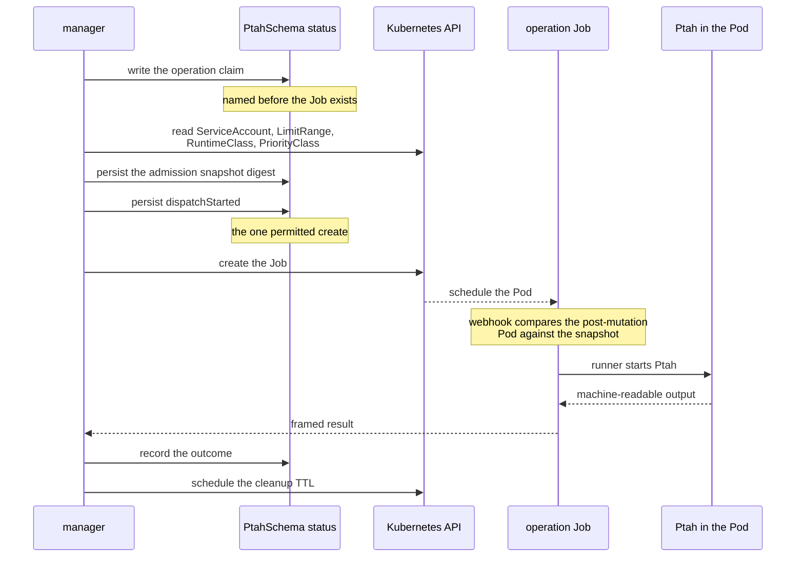

An operation is a durable claim, a Job, a framed result and an outcome
somebody can account for. This page follows one from end to end, then says
how two resources addressing the same database avoid each other. The
lifecycles that decide which operation runs next are
[Reconciliation](../reconciliation/).

## One operation, end to end

The claim is written before the Job exists. That is what lets the controller
tell a Job it created from one it has not created yet, and what lets admission
refuse a Job no claim asked for.

Between the claim and the create sit two more durable boundaries. The
**admission snapshot** binds the exact ServiceAccount, LimitRange defaults,
RuntimeClass scheduling and overhead, PriorityClass values and configured
built-in admission behavior, by UID and resourceVersion; its digest travels in
the Job and Pod annotations, and a fail-closed webhook compares the final
post-mutation Pod against it before scheduling. The **dispatch boundary** is
persisted immediately before the one permitted create attempt: after it, an
Apply Job that is missing or replaced is outcome-unknown and is never
recreated.

Three durable claims live in status, and they are independent on purpose:

- `status.activeOperation` — the operation in flight, and the serialization
  point for one resource.
- `status.pendingObservation` — the post-Apply verification owed after an Apply
  may have mutated the database. It outranks phase changes, ordinary retries and
  newer desired generations, and it snapshots what that verification needs: the
  applied plan,
  the key-free target selector, the coordination digest, the observation policy
  including the protected-table refusal, the Apply holder, the Lease epoch and
  duration, and the
  admission snapshot. A namespace-wide exact-owner Pod scan binds attempts by
  Job name and UID rather than by mutable labels; at most eight Pod UIDs and
  the Pod count are retained as bounded evidence, and a late or duplicate Apply
  Pod invalidates a verification already in flight.
- `status.pendingLockRelease` — the exact Lease owner and epoch, kept until an
  idempotent release succeeds. It closes the window between a terminal status
  transition and clearing an owner-neutral Lease.

A terminal Job stays the active operation until the controller has both read
its result and scheduled its bounded cleanup TTL, so a transient API or RBAC
failure retries the transition instead of orphaning the Job. That TTL is the
one field the manager may add to a Job it already created, and no result is
read before the Job carries its terminal condition.

Reading that result is the one blocking call a reconciliation makes against
something other than the API server's own store: a pod/log request the API
server proxies to a kubelet, streaming a body whose size the executor decides.
Each family runs one reconcile worker and leader election admits one manager,
so a response that stops arriving would hold every other resource of that
family behind it, including the passes that renew the Lease of an Apply that is
still executing SQL. The read carries a deadline of its own: sixty seconds, two
thirds of the shortest Apply Lease the API can produce, or the Lease the
operation itself holds where that is shorter. The worker blocked on a read is
the worker that owes every other resource of the family its Lease renewals, so
a read may hold it for no longer, and has to give it back with time to spend --
a bound equal to the whole Lease would let a read beginning just after a
renewal run until the moment that Lease expired. The Lease is counted whole
rather than less its grace, because the grace is what makes a Lease outlive its
Job and not time withheld from reading the result afterwards.

Sixty seconds still clears what a legitimate result needs, which is about fifty
for the largest frame the protocol admits at a floor of a mebibyte a second.
The two constraints meet close together, and where they conflict the Lease
wins: a maximum-size frame on a slower link times out and is retried, while a
renewal that arrives too late lets another family take a realm whose SQL may
still be running.

Bounding the read shortens the window in which one resource's reconcile holds
up another's and does not close it. Closing it means taking the read off the
reconcile path or giving the family more than one worker. The second bound is the one that matters
at the low end -- the API accepts a deadline of thirty seconds, and spending
two minutes reading the result of thirty seconds of work holds the worker for
longer than the operation it is reporting on.

This bound is not what keeps the realm safe. A read is read-only, and a read
that outlives its Lease authorizes nothing: the epoch is checked before the
result is used, and a Lease that changed hands retires the operation and
discards the result. The deadline makes the read proportionate; the epoch makes
it safe.

That duration is taken from the claim, never from the spec. A Lease is renewed
at the duration the claim recorded -- for the verification after an Apply, the
one `status.pendingObservation` copied from it -- and `activeDeadlineSeconds` can
be raised afterwards without lengthening a Lease already held.

A read that ends at its deadline decides nothing: the claim, the Lease and any
record of an unresolved run are left exactly as they were, because a log this
manager could not read says nothing about what the database now holds. It is
requeued at a fixed short interval rather than raised as a reconcile error,
because the queue's own backoff climbs past the headroom the deadline was
chosen to leave, and a terminal Job produces no further event to bring the
resource back with. The timeout is reported as an Event, so it stays visible
as the failure it is.

One case adds the field to a Job that is still running, and both admission
layers name it: losing database lock continuity during an Apply retires the
operation at once, and the Job left behind would otherwise hold its whole
deadline with nothing left to schedule its collection. The timing changes
nothing -- Kubernetes starts that timer when a Job finishes either way -- so
the exception is written for a schema Apply and for no other shape.

## Concurrency and coordination

One operation claim per resource prevents two Jobs for one resource. Across
resources, coordination is by **database realm**: a Lease keyed by a SHA-256
digest of a versioned tuple of the normalized engine and the exact
`spec.target.coordinationKey`. The key is a non-secret, stable name for one
physical database, and every resource that can mutate that database must use
the same one, including resources that reach it through different DNS aliases,
proxies or credentials. The plaintext key stays in spec; status, plans,
approvals, Jobs and Leases carry only the digest.

Two resources claiming one realm is refused rather than queued unless every
claimant declares `spec.target.sharedRealm`. The census counts `PtahSchema` and
`PtahMigration` together — a suspended or dormant resource claims nothing — and
the refusal names the conflict instead of letting two owners discover each
other through a lock.

The `targetIdentityDigest` is a separate redirect guard inside one plan
lifecycle. It binds the effective route, database name, username, role, SQL
namespace, semantic session options and non-secret transport and
authentication policy immediately before Apply. Password bytes and timing
controls are deliberately excluded, so credential rotation and liveness tuning
stay possible; certificate or CA bytes may rotate behind an unchanged bound
path without authorizing a transport downgrade. Default ports and equivalent
spellings of one address are normalized; DNS absolute-name markers, address
families and MySQL database-name casing are preserved; ambiguous repeated scope
parameters and multi-endpoint targets are rejected.

Both families are held to it in the same place, and by the same code: the
runner refuses to start a mutating child unless the Pod's own database URL
still hashes to the realm and the route identity its approved plan named, and
unless the claim's absolute dispatch and execution deadlines are both present,
ordered and unexpired. The deadline check is repeated immediately before the
child is executed, because a Pod scheduled late or resumed after an
interruption can cross its window while the plan is being prepared, and the
execution deadline is imposed on the child's own context so a run cannot
outlive it. A migration Apply carries two more bindings, since its child
selects its own work: the approved ordered sequence with its digest, and the
fingerprint of the history that sequence was computed against. The runner
cannot re-derive either — it holds no artifact and reads no revision table — so
it enforces that a migration child no plan authorized never starts, and hands
the sequence, digested again, to `ptah migrations up --expect-sequence`. Ptah
compares it with what it selects under its own migration lock and refuses
before it changes anything when the two differ, so the executed sequence is
the approved one or nothing: a history that moved after the approval, forwards
or backwards, reads as a failed run with nothing applied.

All resources use one configurable coordination namespace, so resources in
different namespaces still contend for the same database. The manager's
leader-election Lease lives there too. Replicas of the one supported Helm
release form a single ownership domain with exactly one active reconciler,
while webhook servers stay available on every ready replica. Managers watch
cluster-wide, and the fixed admission configurations form a singleton
availability domain: exactly one release per cluster is supported, and high
availability comes from replicas within it.

The Lease complements the database's own advisory lock. Its immutable duration
covers the maximum Job deadline plus grace. A schema renews the same holder
through its post-Apply verification, including retry delays, and where Job
creation or identity is uncertain that verification waits until the Apply's
execution deadline and the Pod's termination grace have passed, so a possibly
unobserved mutating Pod cannot overlap it. A migration hands the Lease back
once nothing its claim dispatched can still write, and reads its history
afterwards without one; why that is safe is
[Mutation lifecycle](../mutation-lifecycle/#release-coordination).

The executor's advisory lock, its authoritative inspection and the target DDL
share one physical database session. Losing that session aborts the operation
rather than letting pooled DDL continue after the database has released the
lock. The fault-injection suite proves it for the schema Apply on both engines:
on PostgreSQL by joining the advisory lock and the blocked relation lock to one
backend in one database, and on MySQL by binding the named-lock owner to the
metadata-lock waiter.

Raw drift is advisory on purpose: its selector language is not reused as a
planning scope, and its detail never authorizes an Apply. The authoritative
Plan uses the exact `spec.policy.exclude` scope twice, requires byte identity,
and passes those bytes through the native Apply parser in dry-run mode. Apply
recognizes a stale-plan refusal only when the strict native diagnostic names
the reconstructed plan's source fingerprint; that refusal is pre-mutation,
while every other Apply failure after dispatch stays outcome-unknown.
