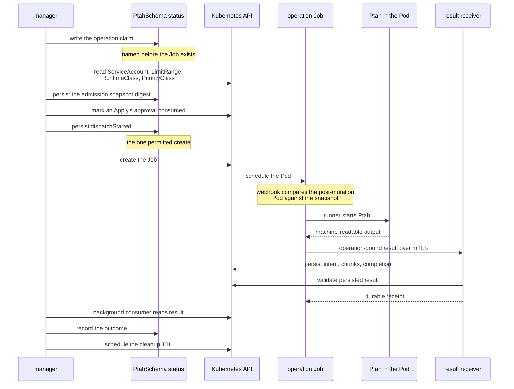

An operation is a durable claim, a Job, a persisted result and an outcome
somebody can account for. This page follows one from end to end, then says
how two resources addressing the same database avoid each other. The
lifecycles that decide which operation runs next are
[Reconciliation](../reconciliation/).

## One operation, end to end

```mermaid
sequenceDiagram
  participant C as manager
  participant S as PtahSchema status
  participant K as Kubernetes API
  participant J as operation Job
  participant P as Ptah in the Pod
  participant R as result receiver

  C->>S: write the operation claim
  Note over S: named before the Job exists
  C->>K: read ServiceAccount, LimitRange,<br/>RuntimeClass, PriorityClass
  C->>S: persist the admission snapshot digest
  C->>K: mark an Apply's approval consumed
  C->>S: persist dispatchStarted
  Note over S: the one permitted create
  C->>K: create the Job
  K-->>J: schedule the Pod
  Note over J: webhook compares the post-mutation<br/>Pod against the snapshot
  J->>P: runner starts Ptah
  P-->>J: machine-readable output
  J->>R: operation-bound result over mTLS
  R->>K: persist intent, chunks, completion
  R->>K: validate persisted result
  R-->>J: durable receipt
  C->>K: background consumer reads result
  C->>S: record the outcome
  C->>K: schedule the cleanup TTL
```

The claim is written before the Job exists. That is what lets the controller
tell a Job it created from one it has not created yet, and what lets admission
refuse a Job no claim asked for.

Between the claim and the create sit two more durable boundaries. The
**admission snapshot** binds the exact ServiceAccount, LimitRange defaults,
RuntimeClass scheduling and overhead, PriorityClass values and configured
built-in admission behavior, by UID and resourceVersion; its digest travels in
the Job and Pod annotations, and a fail-closed webhook compares the final
post-mutation Pod against it before scheduling. The **dispatch boundary** is
persisted immediately before the one permitted create attempt: after it, an
Apply Job that is missing or replaced is outcome-unknown and is never
recreated.

Three durable claims live in status, and they are independent on purpose:

- `status.activeOperation` — the operation in flight, and the serialization
  point for one resource.
- `status.pendingObservation` — the post-Apply verification owed after an Apply
  may have mutated the database. It outranks phase changes, ordinary retries and
  newer desired generations, and it snapshots what that verification needs: the
  applied plan,
  the key-free target selector, the coordination digest, the observation policy
  including the protected-table refusal, the Apply holder, the Lease epoch and
  duration, and the
  admission snapshot. A namespace-wide exact-owner Pod scan binds attempts by
  Job name and UID rather than by mutable labels; at most eight Pod UIDs and
  the Pod count are retained as bounded evidence, and a late or duplicate Apply
  Pod invalidates a verification already in flight.
- `status.pendingLockRelease` — the exact Lease owner and epoch, kept until an
  idempotent release succeeds. It closes the window between a terminal status
  transition and clearing an owner-neutral Lease.

After an execution-binding rotation a `PtahSchema` also carries
`status.pendingBindingRetirement`, which names what the retired epoch left
behind: the plan whose approvals are still to be marked stale, and the Job its
claim dispatched, until that Job has stopped and its cleanup is scheduled. It
authorizes nothing, and no further rotation starts while it is present
([Retire an execution binding](../mutation-lifecycle/#retire-an-execution-binding)).

A terminal Job stays the active operation until the controller has both read
its result and scheduled its bounded cleanup TTL, so a transient API or RBAC
failure retries the transition instead of orphaning the Job. That TTL is the
one field the manager may add to a Job it already created, and no result is
read before the Job carries its terminal condition.

### Durable result protocol

Each Job fixes the result endpoint, operation generation, and credential
projection before admission. The runner uploads one bounded canonical result;
the receiver authenticates its operation, Job and Pod rather than trusting
identity fields in the body. It validates length, digest, protocol and every
chunk, then commits and reads back the complete publication before acknowledging.
An interrupted publication is incomplete until that boundary. Identical retries
return the same receipt; conflicting bytes are refused. A lost acknowledgment
causes delivery retry, never another Ptah execution.

Both controllers use bounded background readers for these records. Payload
upload and result loading do not occupy their reconcile workers. The accepted
record survives removal of the producing Pod and logs, manager replacement,
and process-key loss. There is no fallback to logs or a termination summary
when a durable receipt is missing or invalid.

SQL execution and result persistence are separate transactions. If a runner
dies after mutation and before publication, the outcome can still be unknown.
The existing observation/history recovery and fresh-approval rules apply.

### Legacy result reads

The following log-read behavior applies only when durable delivery is disabled
for a Job. It is outside the default 0.2.0 qualification profile.

Reading that result is the one blocking call a reconciliation makes against
something other than the API server's own store: a pod/log request the API
server proxies to a kubelet, streaming a body whose size the executor decides.
Each family runs one reconcile worker and leader election admits one manager,
so a response that stops arriving would hold every other resource of that
family behind it, including the passes that renew the Lease of an Apply that is
still executing SQL. The read carries a deadline of its own: sixty seconds, two
thirds of the shortest Apply Lease the API can produce, or the Lease the
operation itself holds where that is shorter. The worker blocked on a read is
the worker that owes every other resource of the family its Lease renewals, so
a read may hold it for no longer, and has to give it back with time to spend --
a bound equal to the whole Lease would let a read beginning just after a
renewal run until the moment that Lease expired. The Lease is counted whole
rather than less its grace, because the grace is what makes a Lease outlive its
Job and not time withheld from reading the result afterwards.

Sixty seconds still clears what a legitimate result needs, which is about fifty
for the largest frame the protocol admits at a floor of a mebibyte a second.
The two constraints meet close together, and where they conflict the Lease
wins: a maximum-size frame on a slower link times out and is retried, while a
renewal that arrives too late lets another family take a realm whose SQL may
still be running.

Bounding the read shortens the window in which one resource's reconcile holds
up another's and does not close it. Closing it means taking the read off the
reconcile path or giving the family more than one worker. The second bound is the one that matters
at the low end -- the API accepts a deadline of thirty seconds, and spending
two minutes reading the result of thirty seconds of work holds the worker for
longer than the operation it is reporting on.

This bound is not what keeps the realm safe. A read is read-only, and a read
that outlives its Lease authorizes nothing: the epoch is checked before the
result is used, and a Lease that changed hands retires the operation and
discards the result. The deadline makes the read proportionate; the epoch makes
it safe.

That duration is taken from the claim, never from the spec. A Lease is renewed
at the duration the claim recorded -- for the verification after an Apply, the
one `status.pendingObservation` copied from it -- and `activeDeadlineSeconds` can
be raised afterwards without lengthening a Lease already held.

A timed-out stream waits sixty seconds after the timeout before another read
can start. The resource still reconciles every five seconds and renews its
Lease during that pause. Job events cannot bypass the pause: it belongs to the
Pod UID, so an independent resource or a replacement Pod can still read its
own result. This gives independent Jobs time to finish and be harvested between
blocking attempts. Several stalled Pods can still consume the family's worker;
the pause bounds repeated attempts by one Pod, not the number of faulty nodes.

A read that fails decides nothing by itself: the claim, the Lease and any
record of an unresolved run are left exactly as they were, because a log this
manager could not read says nothing about what the database now holds. A read
that ran out of time, or failed in any other way that may pass, leaves its resource
requeued at a fixed short interval rather than raising a reconcile error, because the
queue's own backoff climbs past the headroom the deadline was chosen to leave,
and a terminal Job produces no further event to bring the resource back with.
Each failed attempt is reported as `ResultReadTimedOut` or `ResultReadFailed`.
Polls that wait for the next attempt do not emit another failure Event.

What ends the wait is the log being gone. Container garbage collection, a
deleted node and a node that stays away all take the log while the Pod object,
and the termination summary in its status, remain. The API server says so
plainly for a deleted node (a NotFound for the Node) and for a container the
kubelet can no longer serve (a BadRequest), and such a log is given up at once.
A failure that may pass -- a kubelet it cannot reach, a read that ran out of
time, a kubelet that does not know the Pod yet -- is given up once reads of that
log have failed for two whole read budgets, two minutes, as this process
watched them; a manager restart starts that measure again, which can only make
it wait longer. Once the kubelet has begun answering, a garbage-collected
container or a removed log file ends the stream with the reason as its body,
which reads as a log that holds no frame. Either way a lost log is judged as a
log with no frame: a read-only operation is retried, a schema Apply is unknown,
and a migration Apply is settled from its termination summary when one stands
in. A Pod that is itself gone takes its status with it, and is unknown as
before.

One case adds the field to a Job that is still running, and both admission
layers name it: losing database lock continuity during an Apply retires the
operation at once, and the Job left behind would otherwise hold its whole
deadline with nothing left to schedule its collection. The timing changes
nothing -- Kubernetes starts that timer when a Job finishes either way -- so
the exception is written for a schema Apply and for no other shape.

## Which runner a Job accepts

The runner is installed from `execution.runnerImage`, and nothing but the
installation ties that image to the manager. Every runner container of a Job --
the one that starts the executor and the guard that authorizes OCI access --
is told the protocol its manager speaks in `PTAH_RUNNER_PROTOCOL_VERSION`. A
runner of another protocol refuses the Job before the executor starts.
With durable delivery, it exits with code 2 and writes the diagnostic
`runner_protocol_mismatch` before reading delivery credentials or contacting
the receiver. It cannot publish a result under the Job's foreign protocol.
Without a receipt, the manager treats an Apply outcome as unknown and uses
read-only database recovery; it never uses diagnostic logs to authorize replay.
A guard that refuses stops the Pod before the fetch that uses the registry
credentials.

In legacy log delivery, the refusal frame carries only the operation, the
error code and the runner's own protocol version. The manager recognizes that
bounded cross-version document as `RunnerProtocolMismatch`.

## Meshes and policy engines

Every operation Pod is held to its Job template: the Pod-intent webhook admits
a Pod whose labels equal the template's, whose annotations equal the
template's apart from the one LimitRanger writes, and whose spec is inside the
admission snapshot. That is the invariant that keeps anything unplanned from
running beside the database credential, and it is also what a service mesh, a
policy engine or a managed platform runs into: a mutating webhook that injects
a sidecar, adds a label or rewrites a resource request produces a Pod the
webhook refuses, and a validating policy that requires a label or an
annotation the template does not carry refuses the Pod before it is scheduled.
Either way the Job controller cannot create the Pod, and until #447 the
resource said only that an operation was in progress.

The contract is `spec.execution.podMetadata`: the labels and annotations the
operation Pods carry beside the operator's own. The builder writes them on the
Job and on its Pod template, the admission snapshot's template digest binds
them, and the webhook admits exactly the Pod they describe. So the cluster's
policy and the operator's meet in the declaration:

- A mesh with namespace injection is opted out of, per Pod, by the annotation
  it reads -- `sidecar.istio.io/inject: "false"` for Istio,
  `linkerd.io/inject: disabled` for Linkerd. A sidecar cannot run beside the
  credential; the opt-out is what the mesh offers for exactly that.
- A policy engine that requires a label or an annotation on every Pod is
  satisfied by declaring it. One that mutates every Pod to add one is
  satisfied by declaring the same key with the same value, so the mutation
  changes nothing and the Pod still equals its template.
- A platform that mutates the Pod spec -- a sidecar, a changed resource
  request, an injected volume -- is refused, because what runs beside the
  credential is not negotiable. Opt the operation Pods out of that mutation
  with the metadata the platform reads, or exclude them by namespace.

The declaration is bounded. Each map takes at most 16 entries; a key is a
Kubernetes qualified name, a label value is what Kubernetes accepts for one,
and an annotation value is at most 1024 bytes. Keys under `ptah.run`,
`kubernetes.io` and `k8s.io`, and any subdomain of them, are refused: they
hold the operator's own labels and annotations, the Job controller's tracking
labels, `app.kubernetes.io`, which every object the chart owns selects on,
and the annotations the API server translates into a Pod's security context.
The bare `controller-uid` and `job-name` keys are refused for the same
reason. The CRD refuses these before the resource is stored, the builder
refuses them again, and the Job write guard refuses a Job that carries one
beyond the operator's envelope whoever built it. Unset, nothing changes: a
resource that declares no metadata dispatches the Pods it always did.

Declaring metadata is a spec change like any other. A read-only operation in
flight is discarded and claimed again with the new template; an Apply that
has dispatched runs to its result under the template it was dispatched with,
because the claim, not the spec, is what a running Job is held to. A plan
does not retire over it: the metadata says nothing about what the plan does
to the database, and the plan fingerprint does not read it, so an approval
stands. Editing the declaration does change what the Job carries, so the Job
intent the controller-write guard rebuilds and compares carries it too.

When a Pod is refused anyway, the resource says so. The Job controller
records a `FailedCreate` Event against the Job with the API server's refusal,
and the operator reads it for a Job that stands with no Pod and reports it as
the condition `Ready=False` with reason `PodAdmissionRefused` on a
`PtahSchema`, `Progressing=False` with the same reason on a `PtahMigration`,
with the refusal in the message and a `PodAdmissionRefused` Event beside it.
The claim stands and the Job keeps its deadline: the Job controller keeps
trying, so a policy that stops refusing lets the Pod through and the
condition goes back to an operation in progress, and a declaration added to
the spec takes effect on the next claim. The message is the API server's own
text, bounded and stripped of control characters; it names the policy or the
webhook and what it wanted, and nothing the operation holds.

## When a Pod is stopped

A node drain, a preemption, an eviction or a Pod deadline stops an operation
Pod the way Kubernetes stops any Pod: SIGTERM to the container, then SIGKILL
once `terminationGracePeriodSeconds` has passed. The runner is the container's
first process, so the signal reaches the runner rather than Ptah. It passes
SIGTERM on, gives Ptah two thirds of the grace to stop, kills it if it has not,
and keeps the last third to deliver the result. Every operation Pod gets
thirty seconds. A schema Apply records its grace on the claim, and every
mutating Pod is told its grace in `PTAH_TERMINATION_GRACE_PERIOD_SECONDS`, so
the runner never sizes the wait against a grace its Pod does not have; a
mutating Pod that is not told is refused before Ptah starts.

Ptah answers SIGTERM by canceling the statement it is running, which rolls
back a migration it runs in a transaction, and then reads the history and
writes its account of the run. A run stopped between two files, or inside one
that rolled back, reports a failed run with the versions it applied, which the
history read that follows confirms, instead of a run nobody can account for.
One stopped inside a file that committed part of its statements reports a
partial run and blocks the resource, as a partial run always has. A child that
does not stop in time writes nothing, and the run is unknown. A schema Apply
that was stopped is unknown either way, because its account is only ever the
whole frame of a run that completed.

Mutating Pods carry `cluster-autoscaler.kubernetes.io/safe-to-evict: "false"`,
so the cluster autoscaler does not remove their node while they run. Nothing
else reads that annotation: a drain, a preemption and node-pressure eviction
still stop the Pod. Whatever stops it with less than its own grace can kill the
runner before its result is persisted, and that run is unknown as it always was:
hard node-pressure eviction gives the Pod the kubelet's minimum of two
seconds, soft eviction caps the grace at the kubelet's
`evictionMaxPodGracePeriod`, and a deletion can ask for a shorter one.

### The termination summary

Durable Jobs retain the bounded termination summary for diagnosis. It cannot
replace a missing durable receipt. The fallback below applies only to legacy
Jobs that deliver results through logs.

The legacy frame lives only in the container log on the node, and that log can be gone
before the manager reads it. So the runner also writes a summary of the frame,
at most 2 KiB, to `/dev/termination-log`, which the kubelet copies into the
Pod's status: the operation id, whether a mutation started and whether its
outcome is uncertain, the error code, the realm and target identity digests,
a migration run's outcome with the count and the first and last applied
versions, and the SHA-256 of the frame it summarizes. It carries no plan, no
error text and nothing Ptah printed.

The migration controller reads it for an Apply, and only when the log holds no
frame, ends inside the frame the summary names, or is gone, once the window in
which a frame may still be arriving has passed. A frame that is
there and was refused is never replaced. A summary that names another attempt
or another frame is set aside with a `TerminationSummaryRefused` Event, and the
run is unknown as before. What a summary says is decided by the same code that
decides a frame, including the check that the run reached the planned
database, so it can report less than the frame would have and never more.

Neither family narrows an unknown outcome on a Pod's report that no mutation
started, not even from a frame: a Job may run more than one Pod, and one Pod's
account of itself says nothing about another. So what a summary adds is a
migration run's outcome and nothing else. The schema family and read-only
operations do not read it, because neither can be decided from less than the
whole frame.

## Concurrency and coordination

One operation claim per resource prevents two Jobs for one resource. Across
resources, coordination is by **database realm**: a Lease keyed by a SHA-256
digest of a versioned tuple. A resource names its realm one of two ways. A
`spec.target.coordinationKey` is hashed with the normalized engine and the
resource's namespace, so it names a realm inside that namespace and nowhere
else. A `spec.target.realmRef` names a cluster-scoped `PtahRealm`, hashed with
the normalized engine and the realm's name, which is the same from every
namespace. Either way the name is non-secret and stable, and every resource
that can mutate one database must use the same one, including resources that
reach it through different DNS aliases, proxies or credentials. The plaintext
key stays in spec; status, plans, approvals, Jobs and Leases carry only the
digest.

A `PtahRealm` is an administrator's grant: it lists the namespaces that may
claim it and says whether more than one claimant may share it. A resource the
realm does not admit is refused with reason `RealmNotAuthorized` before any Job
and is left out of every other claimant's census, so a claim nobody granted
cannot contest a realm. A key needs no grant, because it cannot reach past its
namespace.

Two resources claiming one realm is refused rather than queued unless every
claimant declares `spec.target.sharedRealm`, and, for a `PtahRealm`, unless the
realm's `sharing` is `Shared`. The census counts `PtahSchema` and
`PtahMigration` together — a suspended or dormant resource claims nothing — and
the refusal names the conflict instead of letting two owners discover each
other through a lock.

The `targetIdentityDigest` is a separate redirect guard inside one plan
lifecycle. It binds the effective route, database name, username, role, SQL
namespace, semantic session options and non-secret transport and
authentication policy immediately before Apply. Password bytes and timing
controls are deliberately excluded, so credential rotation and liveness tuning
stay possible; certificate or CA bytes may rotate behind an unchanged bound
path without authorizing a transport downgrade. Default ports and equivalent
spellings of one address are normalized; DNS absolute-name markers, address
families and MySQL database-name casing are preserved; ambiguous repeated scope
parameters and multi-endpoint targets are rejected.

Both families are held to it in the same place, and by the same code: the
runner refuses to start a mutating child unless the Pod's own database URL
still hashes to the realm and the route identity its approved plan named, and
unless the claim's absolute dispatch and execution deadlines are both present,
ordered and unexpired. The deadline check is repeated immediately before the
child is executed, because a Pod scheduled late or resumed after an
interruption can cross its window while the plan is being prepared, and the
execution deadline is imposed on the child's own context. At that deadline the
child is asked to stop exactly as it is when its Pod is stopped
([When a Pod is stopped](#when-a-pod-is-stopped)), and killed if it is still
running two thirds of the Pod's grace later. A run outlives its deadline by at
most that, which is inside the whole grace the controller waits out before it
reads the database after an Apply it cannot account for. A migration Apply
carries two more bindings, since its child selects its own work: the approved
ordered sequence with its digest, and the
fingerprint of the history that sequence was computed against. The runner
cannot re-derive either — it holds no artifact and reads no revision table — so
it enforces that a migration child no plan authorized never starts, and hands
the sequence, digested again, to `ptah migrations up --expect-sequence`. Ptah
compares it with what it selects under its own migration lock and refuses
before it changes anything when the two differ, so the executed sequence is
the approved one or nothing: a history that moved after the approval, forwards
or backwards, reads as a failed run with nothing applied.

All resources use one configurable coordination namespace, so resources in
different namespaces still contend for the same database. The manager's
leader-election Lease lives there too. Replicas of the one supported Helm
release form a single ownership domain with exactly one active reconciler,
while webhook servers stay available on every ready replica. Managers watch
cluster-wide, and the fixed admission configurations form a singleton
availability domain: exactly one release per cluster is supported, and high
availability comes from replicas within it.

The Lease complements the database's own advisory lock. Its immutable duration
covers the maximum Job deadline plus grace. A schema renews the same holder
through its post-Apply verification, including retry delays, and where Job
creation or identity is uncertain that verification waits until the Apply's
execution deadline and the Pod's termination grace have passed, so a possibly
unobserved mutating Pod cannot overlap it. A migration hands the Lease back
once nothing its claim dispatched can still write, and reads its history
afterwards without one; why that is safe is
[Mutation lifecycle](../mutation-lifecycle/#release-coordination).

The executor's advisory lock, its authoritative inspection and the target DDL
share one physical database session. Losing that session aborts the operation
rather than letting pooled DDL continue after the database has released the
lock. The fault-injection suite proves it for the schema Apply on both engines:
on PostgreSQL by joining the advisory lock and the blocked relation lock to one
backend in one database, and on MySQL by binding the named-lock owner to the
metadata-lock waiter.

Raw drift is advisory on purpose: its selector language is not reused as a
planning scope, and its detail never authorizes an Apply. The authoritative
Plan uses the exact `spec.policy.exclude` scope twice, saves each read with
`schema plan --output`, requires the two files to be byte-identical, and passes
those bytes through `schema apply --dry-run`, whose report must name their
digest and list their statements in order. Each step is read from the JSON
document Ptah prints under `--json`, never from the text it writes for a
person. Apply reads its own report on every exit status, and only `applied`
naming the approved plan's digest is a success. A `stale-plan` refusal is
reported as such, and every Apply failure after dispatch, that refusal
included, stays outcome-unknown until an observation settles it.
