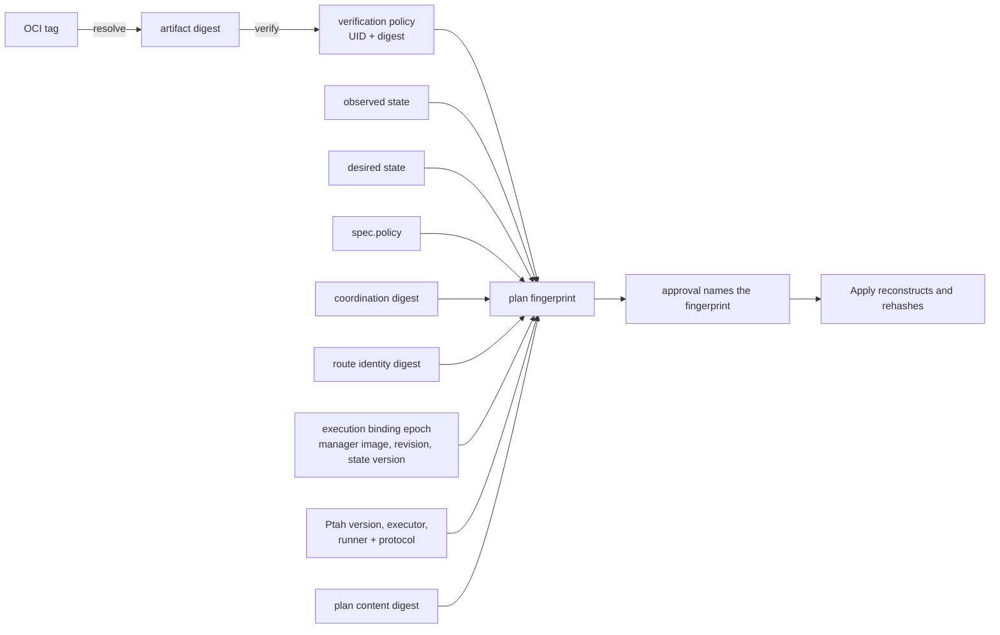

A plan is the only thing an Apply may execute, and it is immutable in every
sense the operator can enforce. This page says what it binds, where its bytes
live, and what a decision about it covers. Reading a published plan is
[Read a plan](../../use/read-a-plan/).

## Immutable bindings

A plan is controller-created and immutable. Its fingerprint is what an approval
names, and what the controller recomputes from live inputs before an Apply may
run: a changed input produces a different plan rather than a changed one.

A schema plan fingerprint binds the plan contract version, the schema UID, the
plan content digest, the artifact digest, the coordination digest, the
credential-free route identity, the observed and desired state fingerprints,
the reconciliation policy, the verification policy UID and digest, the
execution binding epoch, the digest-pinned manager image, manager revision and
controller-state version, the Ptah version and executor image, and the runner
image and protocol version. The schema *name* is not in it — a name can be
reused, so the UID is what identifies the resource.

A migration plan fingerprint binds the same execution and target identity, and
instead of observed and desired state it binds the ordered sequence, each
migration's version, version key, checksum, checkpoint flag and transaction
mode, the history fingerprint it was computed against, and the version the
history stood at.

Those two transaction modes are different statements and both are bound. The
one inside the sequence is what each file declares; the one inside the apply
policy is what `spec.policy.transactionMode` asks Ptah to do, and unset is its
own value there. Editing the second retires the plan and its approval, because
a sequence approved under one wrapping is a different execution under another.

Plan bytes are split into immutable ConfigMaps: at most sixteen chunks of at
most 512 KiB, for a plan of at most 8 MiB, with the chunk count derived from
those two limits so storage cannot advertise more capacity than the runner can
execute. The plan status commits the concrete ConfigMap UIDs only after every
chunk has been read back and verified, and Apply checks names, UIDs, ordering,
sizes, per-chunk hashes and the complete hash before dispatching.

An approval repeats the bindings and is stamped by mutating admission with the
authenticated username, UID, groups, request UID and time — whatever a client
writes in those fields is replaced. Validating admission then reads the current
schema, plan and verification policy directly from the API server, and the
controller performs the same checks again before Apply.

## Declarative reference data

A declaration can name rows as well as tables. A plan for such a change
declares the row sets it touched in `managed_rows` and a `rows_fingerprint` --
schema, table, keys and column names, plus a digest, and no value. That summary
is what lets the operator bind a row-only change and report on it without
learning any of the data.

The statements in the same plan are a different matter. A plan carries the SQL
it would execute, and the SQL for a data change carries literal values, so the
plan bytes are data. They are stored in immutable ConfigMaps and reconstructed
by `kubectl ptah plan`: whoever may read a plan may read the rows in it, and
that is the access decision to make. What never carries a value is everything
outside the plan — status, Events and the controller's log.

Status carries counts by category — rows inserted, updated, deleted — with no
key, no column name and no value. A row-only change still retires a waiting
plan, because the row fingerprint is inside the bytes the content digest
covers.

`spec.policy.protectedTables` names tables the declarative path may not change.
A plan that would change a listed table is refused rather than rated, and the
refusal has no override: an approval, `allowDestructive` and a permissive
severity are all answers to "how risky is this", and naming a table here says
that no such answer exists for it. The resource goes to `Blocked` with
reason `ProtectedTable` on `PlanReady`, `InSync` and `Ready`, no failure is
recorded, no plan is published, and the operation ends rather than re-planning
within the second. Where the change is wanted, the entry goes, or the rows are
written as a migration.
