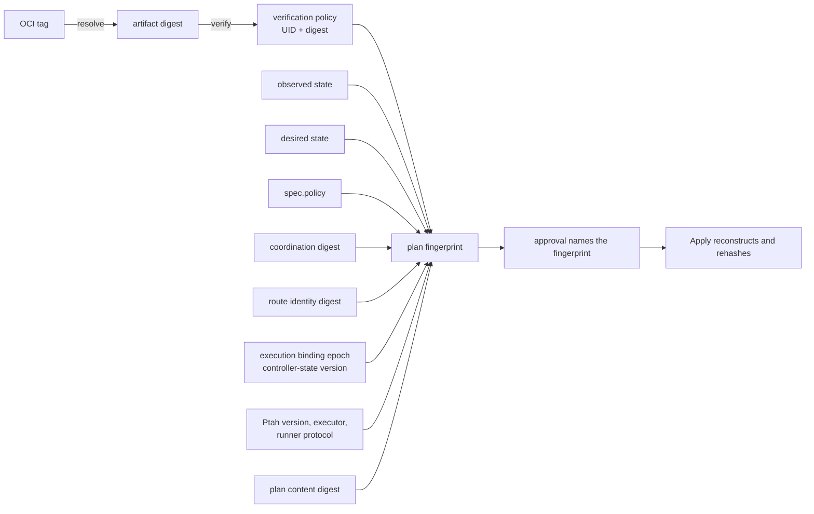

A plan is the only thing an Apply may execute, and it is immutable in every
sense the operator can enforce. This page says what it binds, where its bytes
live, and what a decision about it covers. Reading a published plan is
[Read a plan](../../use/read-a-plan/).

## Immutable bindings

A plan is controller-created and immutable. Its fingerprint is what an approval
names, and what the controller recomputes from live inputs before an Apply may
run: a changed input produces a different plan rather than a changed one.

```mermaid
flowchart LR
  tag["OCI tag"] -->|resolve| digest["artifact digest"]
  digest -->|verify| policy["verification policy<br/>UID + digest"]
  policy --> plan["plan fingerprint"]
  observed["observed state"] --> plan
  desired["desired state"] --> plan
  reconcile["spec.policy"] --> plan
  realm["coordination digest"] --> plan
  route["route identity digest"] --> plan
  epoch["execution binding epoch<br/>controller-state version"] --> plan
  ptah["Ptah version, executor,<br/>runner protocol"] --> plan
  bytes["plan content digest"] --> plan
  plan --> approval["approval names the fingerprint"]
  approval --> apply["Apply reconstructs and rehashes"]
```

A schema plan fingerprint binds the plan contract version, the schema UID, the
plan content digest, the artifact digest, the coordination digest, the
credential-free route identity, the observed and desired state fingerprints,
the reconciliation policy, the verification policy UID and digest, the
execution binding epoch, the controller-state version, the Ptah version and
executor image, and the runner protocol version. It also binds what the
manager read out of the plan bytes: whether they are destructive, which kinds
of privilege they change, and how many statements they hold. The bytes alone
do not fix those -- a manager whose classifier reads a statement differently
derives different values from the same content -- and the approval and the
apply policy were decided on them. The schema *name* is not in it — a name can
be reused, so the UID is what identifies the resource.

The manager that published the plan is not in it either. The plan records the
manager's image and revision and the runner image beside it, and a later
release of the manager computing the same plan finds the same fingerprint and
the same object. An approval names none of the three. So a manager release that
changes only them -- a patch or a security fix -- keeps every published plan
and every pending approval, and applies them, as long as it reads the plan bytes
the same way. Before it dispatches an Apply the manager decodes the stored plan
again with its own classifier, and a plan it reads differently is retired and
planned again under the new reading, which is a different fingerprint and
needs its own approval where the policy asks for one. What the runner enforces
is bound through the protocol version, which changes whenever that enforcement
does.

A migration plan fingerprint binds the same execution and target identity, and
instead of observed and desired state it binds the ordered sequence, each
migration's version, version key, checksum, checkpoint flag and transaction
mode, the history fingerprint it was computed against, and the version the
history stood at.

Those two transaction modes are different statements and both are bound. The
one inside the sequence is what each file declares; the one inside the apply
policy is what `spec.policy.transactionMode` asks Ptah to do, and unset is its
own value there. Editing the second retires the plan and its approval, because
a sequence approved under one wrapping is a different execution under another.

Plan bytes are split into immutable ConfigMaps: at most sixteen chunks of at
most 512 KiB, for a plan of at most 8 MiB, with the chunk count derived from
those two limits so storage cannot advertise more capacity than the runner can
execute. The plan status commits the concrete ConfigMap UIDs only after every
chunk has been read back and verified, and Apply checks names, UIDs, ordering,
sizes, per-chunk hashes and the complete hash before dispatching.

An approval repeats the bindings and is stamped by mutating admission with the
authenticated username, UID, groups, request UID and time — whatever a client
writes in those fields is replaced. Validating admission then reads the current
schema, plan and verification policy directly from the API server, and the
controller performs the same checks again before Apply.

## Declarative reference data

A declaration can name rows as well as tables. A plan for such a change
declares the row sets it touched in `managed_rows` and a `rows_fingerprint` --
schema, table, keys and column names, plus a digest, and no value. That summary
is what lets the operator bind a row-only change and report on it without
learning any of the data.

The statements in the same plan are a different matter. A plan carries the SQL
it would execute, and the SQL for a data change carries literal values, so the
plan bytes are data. They are stored in immutable ConfigMaps and reconstructed
by `kubectl ptah plan`: whoever may read a plan may read the rows in it, and
that is the access decision to make. What never carries a value is everything
outside the plan — status, Events and the controller's log. The Plan Pod's log
is not outside it: the runner hands the plan to the controller through that
log, so reading it is reading the plan
([Pod logs carry plans](../../use/security/#pod-logs-carry-plans)).

Status carries counts by category — rows inserted, updated, deleted — with no
key, no column name and no value. A row-only change still retires a waiting
plan, because the row fingerprint is inside the bytes the content digest
covers.

`spec.policy.protectedTables` names tables the declarative path may not change.
A plan that would change a listed table is refused rather than rated, and the
refusal has no override: an approval, `allowDestructive` and a permissive
severity are all answers to "how risky is this", and naming a table here says
that no such answer exists for it. The resource goes to `Blocked` with
reason `ProtectedTable` on `PlanReady`, `InSync` and `Ready`, no failure is
recorded, no plan is published, and the operation ends rather than re-planning
within the second. Where the change is wanted, the entry goes, or the rows are
written as a migration.

## Plans that change privileges {#privilege-changes}

`destructive` answers whether a plan can lose data. A plan that grants a role
access to a table, makes a function run with its owner's rights or opens a
table's rows to everyone loses nothing, and Ptah rates those statements `safe`.
Read alone, that rating would let `apply: Always` apply them with nobody
looking.

So the operator reads every statement itself and records the kinds of authority
the plan changes in `spec.privilegeChanges`, which `status.plan.privilegeChanges`
repeats. A plan that lists any kind needs an approval naming its exact bytes,
whatever `spec.policy.apply` says. Under `Always` the schema waits in
`AwaitingApproval` with `ApprovalRequired=True` and reason `PrivilegeChanges`,
and the condition message names the kinds. Under `OnApproval` it waits as it
always did, and under `Never` nothing runs. No field turns this off: an
approval is how a person agrees to a change of authority, and a switch that
waived it would be the same `Always` again.

| Kind | Raised by |
| --- | --- |
| `Grant` | `GRANT` of a privilege on an object, including `ALTER DEFAULT PRIVILEGES ... GRANT` |
| `Revoke` | `REVOKE` of a privilege, including `ALTER DEFAULT PRIVILEGES ... REVOKE`, and `DROP OWNED` |
| `RoleMembership` | `GRANT role TO role`, `REVOKE role FROM role`, `ALTER GROUP ... ADD USER` or `DROP USER`, MySQL `SET DEFAULT ROLE` |
| `Role` | `CREATE`, `ALTER` or `DROP` of a `ROLE`, `USER` or `GROUP`: attributes such as `SUPERUSER`, and per-role settings; `SET ROLE` and `SET SESSION AUTHORIZATION`, which change who the rest of the Apply runs as |
| `Ownership` | `OWNER TO`, `REASSIGN OWNED`, `CREATE SCHEMA ... AUTHORIZATION` |
| `RowSecurityPolicy` | `CREATE`, `ALTER` or `DROP POLICY`, and `DISABLE` or `NO FORCE ROW LEVEL SECURITY` |
| `SecurityDefiner` | `SECURITY DEFINER` on a function or procedure; MySQL `SQL SECURITY DEFINER`, and a MySQL or MariaDB `CREATE FUNCTION` or `PROCEDURE` that does not say `SQL SECURITY INVOKER`; a PostgreSQL view's `security_invoker` set to `false` or `off`, or reset |
| `Definer` | a MySQL `DEFINER =` clause on a view, routine, trigger or event |
| `FunctionReplacement` | `CREATE OR REPLACE FUNCTION` or `PROCEDURE` |

The classifier reads keywords. It does not parse SQL the way the server does
and does not evaluate anything, so it is a filter in front of an approval rather
than a boundary. What an Apply can do is bounded by the database login it runs
as: a login with no right to grant, create roles or own other roles' objects
cannot do any of those things, whatever a plan says and whatever this reading
misses. Keep that login to what the artifact manages --
[Databases and privileges](../../support/databases/#postgresql-authority) says
what that is for each engine, and
[Does the login need superuser?](../../faq/#least-privilege-login) says why the
answer is no.

The reading errs the same way the destructive one does. It reads keywords,
never what a clause evaluates to, so it raises every policy: `USING (true)` and
a tenant filter look alike to it, and so does `USING (tenant_id = tenant_id)`,
which opens the table as surely as `true` does. It raises every
`CREATE OR REPLACE FUNCTION`, because a plan does not say whether the function
existed. Ptah writes a new PostgreSQL function that way too, trigger functions
included, so under `Always` any plan that creates or changes one waits for an
approval. It reads function bodies, so a `GRANT` that only runs when the
function is called is raised as well. And it reads each statement under both
string-escaping modes the server might be in, and reads dollar-quoted bodies,
`E''` strings and nested comments the way PostgreSQL does, so a quote cannot
hide a clause from it.

MySQL and MariaDB run a stored routine with its definer's rights unless it says
`SQL SECURITY INVOKER`, so a routine that names no mode is raised as
`SecurityDefiner` whether or not the statement says so. Anyone with `EXECUTE`
on it runs its body with the rights of the login that created it. To keep a
plan that creates a routine unattended, declare the routine with invoker rights
(`security = "INVOKER"`), and the plan carries `SQL SECURITY INVOKER`.

The class only adds. Ptah's plan document has no field for it and a document
that tried to supply one is refused, a statement Ptah rated `safe` is raised all
the same, and nothing about it lowers `destructive`. What Ptah already rates
destructive stays destructive -- `DROP ROLE`, `DROP POLICY`, `DROP FUNCTION`,
and switching row security off or unforcing it -- and such a plan still needs
`allowDestructive` as well; the kinds say what else it changes. Status carries
the kinds and nothing else: no object, no role and no statement text.

What it cannot see:

- Rights that come from an engine default on an object other than a routine. A
  view in either engine reads its tables with its owner's rights unless it says
  otherwise, and a MySQL trigger, like a MySQL view that names no
  `SQL SECURITY`, runs as its definer. Ptah writes no `SQL SECURITY` clause on a
  MySQL view, so no MySQL view is raised.
- SQL built at run time, such as a `DO` block that `EXECUTE`s a string.
- `CREATE EXTENSION`, whose install script runs with whatever rights the
  extension asks for.
- A `PtahMigration`. Its plan is a sequence of files the operator does not
  read, so `Always` applies it as published, which is why `OnApproval` is its
  default.
