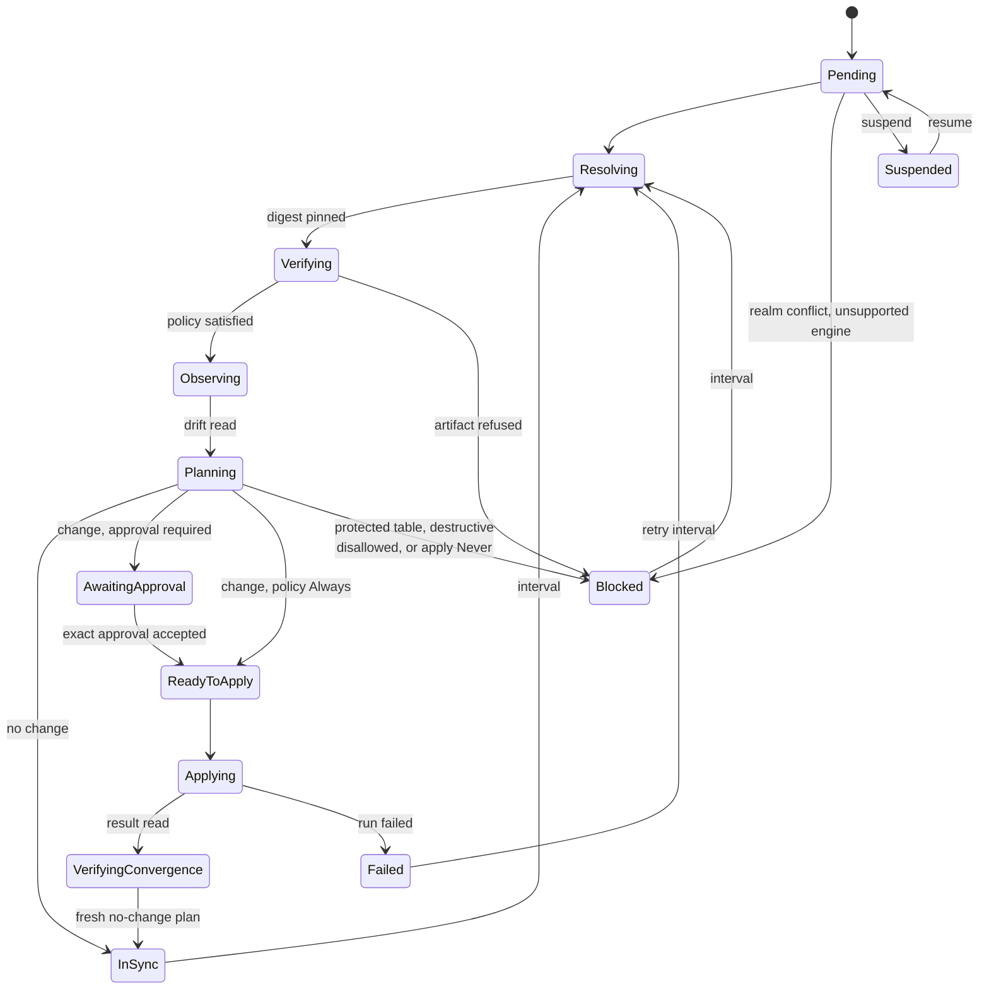
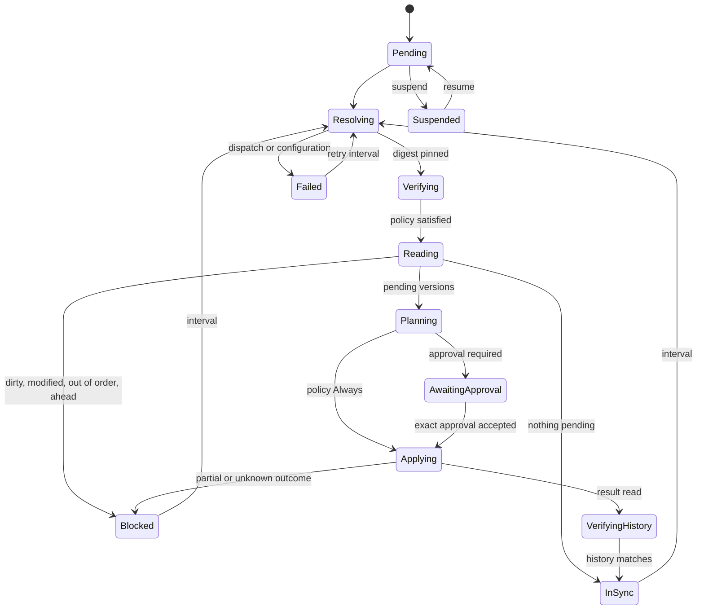

Both families converge a database towards what a resource declares, and they
do it differently enough that the two lifecycles are described side by side
rather than merged. What the operator is put together from is
[Architecture](../architecture/); what enforces each promise, per family, is
[Execution guarantees](../guarantees/).

## The schema lifecycle

Five operations run as Jobs: `Resolve`, `Verify`, `Observe`, `Plan`, `Apply`.
Approval is not an operation — it is a phase in which nothing runs.

- **Resolve** records the immutable digest behind the requested OCI reference.
- **Verify** evaluates the selected policy and independently inspects the
  digest-pinned artifact type.
- **Observe** fetches the verified schema by digest and validates a raw,
  read-only drift report. The report's detail stays inside the runner: status
  receives a digest, a dialect, a total count, the highest severity, and
  bounded category-level aggregates.
- **Plan** performs two independent native scoped plans while holding the
  database-realm Lease, accepts only byte-identical results, and then makes the
  native Apply path parse and dry-run those exact bytes. A no-change result is
  the authoritative statement that the database converged; changed bytes are
  published.
- **Apply** reconstructs and hashes the published bytes immediately before
  executing them.

After an Apply, `Observe` and `Plan` run again under the original Apply Lease.
Only a new, coherent no-change plan establishes convergence: a process exit
never establishes that the database changed the way the plan said it would.

### Blocked is a refusal, not a fault

`Blocked` means the answer will not change until somebody changes an input. It
is reached from six places: a realm conflict, an unsupported engine, a
verification policy that refused the artifact, a plan that would change a
a protected table, a destructive plan the policy disallows, and `apply: Never`,
which is not a problem at all — it is the policy that records plans and applies
none, and a resource can sit there for as long as somebody wants. `Failed` is
different again: something went wrong and a retry is reasonable.

A blocked resource still refreshes on its interval through the complete
Resolve → Verify → Observe → Plan pipeline, so a policy edit or a new artifact
is noticed without anybody touching the resource.

### Suspended, and losing a lock

`spec.suspend` prevents new Jobs. A Job already applying is still observed to a
terminal result, because abandoning it would leave the database in a state
nothing recorded; suspension while an operation is live stages the Lease
release first.

`leaseContinuityLost` is set before any result can be harvested when the
persisted epoch no longer owns an uninterrupted lock interval. A result
produced across an epoch change is discarded rather than read: the lock it held
was somebody else's by then.

## The migration lifecycle

Four operations run as Jobs: `Resolve`, `Verify`, `History`, `Apply`. Only
`Apply` takes the database-realm Lease; reading history does not, because it
mutates nothing.

Reading the history produces one of six verdicts, and the operator never
guesses at any of them: the revision table is dirty; a recorded migration's
checksum no longer matches the artifact; a pending version sorts below one
already applied; the database is ahead of the artifact; nothing is pending; or
a sequence is ready to plan. Pending selection is Ptah's own list rather than a
subtraction of counts, because a checkpoint bootstrap makes those two answers
differ.

The two ways out of the ordinary path are the same two words the schema path
uses, and they mean the same thing here. `Blocked` is a verdict about the
database that will not change on its own; `Failed` is a configuration or
dispatch failure the controller could not resolve by retrying immediately, and
it retries on its own interval.

An outcome that is `Partial` or `Unknown` refuses every later Apply until the
database itself settles it. The resource goes to `Blocked`, and only a history
reading that shows nothing pending releases it — never a retry, because
replaying a non-idempotent statement is exactly the damage the refusal exists to
prevent. Every other outcome is confirmed by reading the history back in
`VerifyingHistory`.

Adoption of an existing schema is deliberately not an operator feature: an
empty revision table reads as everything pending, and the answer is Ptah's own
`migrations baseline`, run by a person against a shadow database. The operator
never holds a shadow credential.
