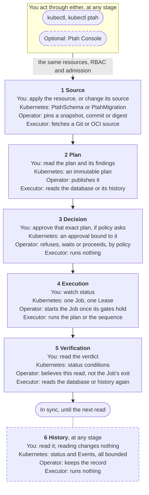
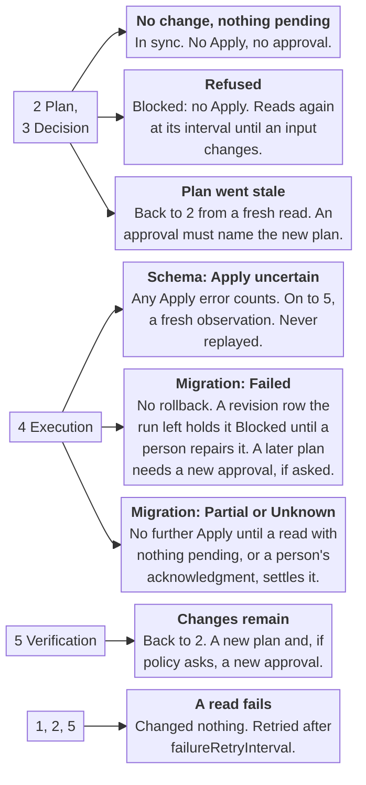
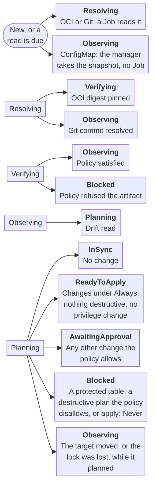
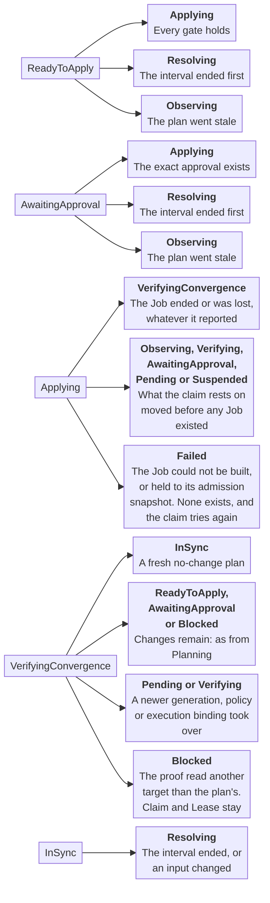
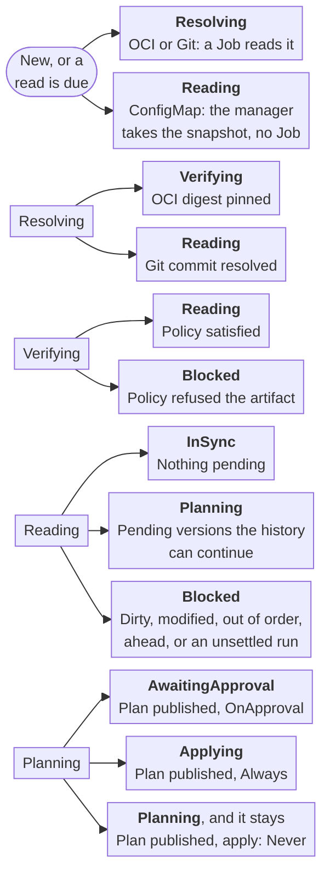
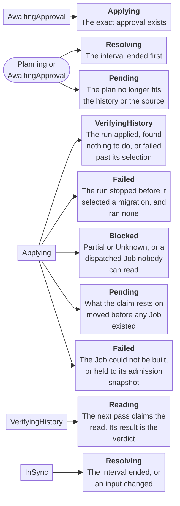
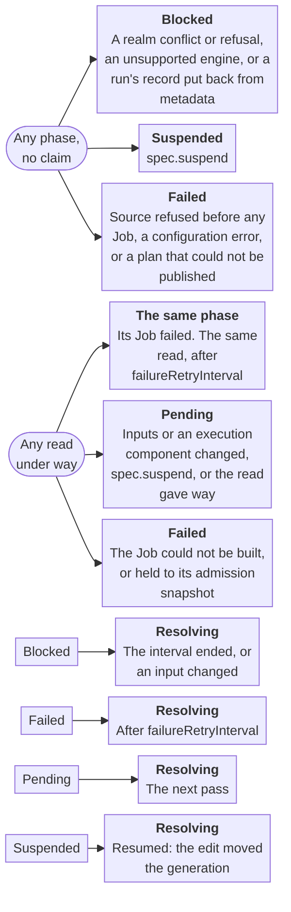

Both families converge a database towards what a resource declares, and they
do it differently enough that the two lifecycles are described side by side
rather than merged. What the operator is put together from is
[Architecture](../architecture/); what enforces each promise, per family, is
[Execution guarantees](../guarantees/).

## From source to verified change {#from-source-to-verified-change}

A change reaches a database along one path, whichever resource carries it. You
declare what you want, the operator plans it and holds it to your policy, a
Ptah executor runs it in a Job, and a later read proves what happened. The
[schema](#the-schema-lifecycle) and [migration](#the-migration-lifecycle)
lifecycles below are the precise reference. To walk the path with commands, use
[First schema](../../start/first-schema/#stage-by-stage) or
[Run versioned migrations](../../use/migrations/#stage-by-stage).

`kubectl` and the [`kubectl ptah` plugin](../../use/read-a-plan/) cover every
stage. [Ptah Console](https://github.com/stokaro/ptah-console) is optional: it
is another interface to the same Kubernetes resources, under the same RBAC and
admission rules, and it runs no database change itself. Running the standalone
Ptah CLI directly against a database is a different path. No plan, approval or
journal entry records it, and the operator finds the result at its next read.


```mermaid
---
config:
  look: classic
  themeVariables:
    fontSize: 14px
  flowchart:
    wrappingWidth: 340
    nodeSpacing: 16
    rankSpacing: 26
---
flowchart TD
  accTitle: The path of a database change, in six numbered stages
  accDescr: The table after this diagram gives each stage and who does what in it. Ptah Console is optional, and no stage needs it.
  subgraph you["You act through either, at any stage"]
    direction LR
    cli(["kubectl, kubectl ptah"])
    console(["Optional: Ptah Console"])
  end
  source["<b>1 Source</b><br/>You: apply the resource, or change its source<br/>Kubernetes: PtahSchema or PtahMigration<br/>Operator: pins a snapshot, commit or digest<br/>Executor: fetches a Git or OCI source"]
  plan["<b>2 Plan</b><br/>You: read the plan and its findings<br/>Kubernetes: an immutable plan<br/>Operator: publishes it<br/>Executor: reads the database or its history"]
  decision["<b>3 Decision</b><br/>You: approve that exact plan, if policy asks<br/>Kubernetes: an approval bound to it<br/>Operator: refuses, waits or proceeds, by policy<br/>Executor: runs nothing"]
  execution["<b>4 Execution</b><br/>You: watch status<br/>Kubernetes: one Job, one Lease<br/>Operator: starts the Job once its gates hold<br/>Executor: runs the plan or the sequence"]
  verification["<b>5 Verification</b><br/>You: read the verdict<br/>Kubernetes: status conditions<br/>Operator: believes this read, not the Job's exit<br/>Executor: reads the database or history again"]
  insync(["In sync, until the next read"])
  history["<b>6 History</b>, at any stage<br/>You: read it; reading changes nothing<br/>Kubernetes: status and Events, all bounded<br/>Operator: keeps the record<br/>Executor: runs nothing"]
  you -->|"the same resources, RBAC and admission"| source
  source --> plan --> decision --> execution --> verification --> insync
  insync -.- history
  classDef optional stroke-dasharray: 5 4
  class console,history optional
```

The same path, with where to read about each stage. The executor is Ptah
itself, run by the operator in a Job.

| Stage | You | Kubernetes resources | Operator | Ptah executor |
| --- | --- | --- | --- | --- |
| [1 Source](../../use/sources/) | `kubectl apply`, or `kubectl ptah set-source` for another OCI artifact | `PtahSchema` or `PtahMigration`, and the source it names | Pins the content: a [ConfigMap snapshot](#a-configmap-source), a [Git commit](#a-git-source), or an OCI digest its verification policy accepts | Runs a Resolve Job for Git and OCI, and a Verify Job for OCI. A ConfigMap needs neither |
| [2 Plan](../../use/read-a-plan/) | `kubectl ptah plan`, `schema` or `migration` shows the plan's identity, contents and findings | `PtahSchemaPlan` and its chunks, or `PtahMigrationPlan` | Publishes a plan bound to what was read | Observes the database and plans, or reads the revision table |
| [3 Decision](../../use/approvals/) | `kubectl ptah approve`, when the policy asks | `PtahSchemaApproval` or `PtahMigrationApproval`, stamped by admission | Applies `spec.policy`: refuses, waits for an approval of this exact plan, or proceeds | Runs nothing |
| [4 Execution](../../use/operations/#wait) | `kubectl ptah wait`, or `approve --wait` | An Apply Job and the database-realm Lease | Creates the Job once every gate holds | Runs the plan or the approved sequence |
| [5 Verification](../../use/operations/#normal-status-progression) | `kubectl ptah schema` or `migration` | Status conditions | Takes this read as the proof, not the Job's exit | Reads the database or the revision table again |
| [6 History](#the-lifecycle-journal) | `kubectl get`, `kubectl ptah plan --applied`, `kubectl events` | Status, stored plans and approvals, Events | Writes the record in the status writes it already makes | Runs nothing |

History is not a step after verification, and reading it changes nothing.
`status.journal` records when a plan was published, approved and applied and
how each attempt ended. [The lifecycle journal](#the-lifecycle-journal) says how
far back it reaches, and how much sooner Events and finished Jobs go. A migration
also keeps the newest rows of its revision table in `status.history.revisions`,
and its last run in `status.lastRun`. A schema keeps what its last confirmed
Apply ran in `status.applied`, and `kubectl ptah plan --applied` prints that
plan. None of this is an unlimited audit log, and what a resource holds depends
on the version that wrote it: `coveredSince` says when its journal began, and a
revision table too old to record a duration leaves a row's `executionMillis`
absent.

### Where the path turns {#where-the-path-turns}


```mermaid
---
config:
  look: classic
  themeVariables:
    fontSize: 14px
  flowchart:
    wrappingWidth: 260
    nodeSpacing: 12
    rankSpacing: 10
    padding: 4
    diagramPadding: 6
---
flowchart LR
  accTitle: Where the path of a database change turns
  accDescr: The list after this diagram gives each branch and what follows it.
  before["2 Plan,<br/>3 Decision"]
  execution["4 Execution"]
  verification["5 Verification"]
  reads["1, 2, 5"]
  before --> nochange["<b>No change, nothing pending</b><br/>In sync. No Apply, no approval."]
  before --> refused["<b>Refused</b><br/>Blocked: no Apply. Reads again<br/>at its interval until an input<br/>changes."]
  before --> stale["<b>Plan went stale</b><br/>Back to 2 from a fresh read. An<br/>approval must name the new plan."]
  execution --> unknown["<b>Schema: Apply uncertain</b><br/>Any Apply error counts. On to 5,<br/>a fresh observation. Never<br/>replayed."]
  execution --> failed["<b>Migration: Failed</b><br/>No rollback. A revision row the<br/>run left holds it Blocked until a<br/>person repairs it. A later plan<br/>needs a new approval, if asked."]
  execution --> unresolved["<b>Migration: Partial or Unknown</b><br/>No further Apply until a read with<br/>nothing pending, or a person's<br/>acknowledgment, settles it."]
  verification --> remain["<b>Changes remain</b><br/>Back to 2. A new plan and, if<br/>policy asks, a new approval."]
  reads --> retry["<b>A read fails</b><br/>Changed nothing. Retried after<br/>failureRetryInterval."]
```

The operator rolls nothing back. Each branch has its own recovery, and
[Failure recovery](../../use/operations/#failure-recovery) has the detail.

- **No change, nothing pending.** A no-change plan or a history with nothing
  pending needs no Apply and no approval, and the resource reports `InSync`.
- **Refused.** [`Blocked`](#blocked-is-a-refusal-not-a-fault) does not proceed
  to Apply. It keeps reading at its interval, so a changed input is noticed
  without anybody touching the resource. A migration's history refuses at stage
  2 when it is dirty, modified, out of order or ahead. A migration under
  `apply: Never` rests in `Planning` instead, with `Ready=False`, reason
  `ApplyDisabled`.
- **Plan went stale.** A changed input retires the plan before Apply. The
  resource reads the database or the history again and plans again, and an
  approval of the old plan does not carry over. `kubectl ptah approve` approves
  nothing if the plan it showed was replaced. Read the replacement, then approve
  that.
- **Schema, Apply uncertain.** Every Apply error is reported as
  `ApplyOutcomeUnknown`, and the plan is never replayed. A fresh read-only
  observation comes before anything else. If it finds no change the schema is
  `InSync`, with reason `ConvergedAfterUnknownOutcome`; otherwise it plans
  again. That observation is bound to the plan's target: one whose URL names
  another is refused before it connects, and the resource stops, `Blocked`,
  until [a person ends it](../../use/recovery/#a-schema-whose-target-moved).
- **Migration, `Failed`.** [`status.lastRun`](../../use/migrations/#what-the-run-reports)
  says how far the run got. A migration that failed at a statement leaves a
  dirty revision row, and the history read that follows holds the resource
  `Blocked`, reason `HistoryDirty`, until a person
  [clears it with Ptah](../../use/recovery/#failed-statement). A run
  that stopped before it selected a migration leaves no row, and the resource
  starts again after `spec.execution.failureRetryInterval`. Either way a later
  plan needs its own approval under `apply: OnApproval`, because the run spent
  the one it carried.
- **Migration, `Partial` or `Unknown`.** The run stays in
  `status.unresolvedRun`, and the resource [publishes no plan and dispatches no
  Apply](../../use/operations/#a-migration-run-nobody-accounted-for) until it is
  settled. [A history read of that database with nothing pending](../../use/operations/#how-it-clears)
  settles it. So does a [`PtahMigrationRunAcknowledgment` bound to that
  run](../../use/operations/#clear-unresolved-run), which a person creates after
  establishing what the run did.
- **Changes remain.** A proof that still finds changes publishes a new plan.
- **A read fails.** Resolve, Verify, Observe, Plan and a history read change
  nothing, so they retry after `spec.execution.failureRetryInterval`.

### What differs between a schema and a migration {#schema-and-migration}

| | `PtahSchema` | `PtahMigration` |
| --- | --- | --- |
| The plan holds | The generated SQL, which `kubectl ptah plan` prints | The prepared versions and checksums. `kubectl ptah migration` and `approve` print no SQL: it stays in the source |
| The proof is | A fresh observation and a no-change plan: `InSync=True`, reason `ScopedConverged` | A fresh history read: phase `InSync`, `Ready=True`, reason `HistoryMatched` |
| An Apply nobody can account for | Goes straight to a fresh observation, which can settle it | Stops every later Apply until a read or a person settles it |
| Walk it with | [First schema](../../start/first-schema/#stage-by-stage) | [Run versioned migrations](../../use/migrations/#stage-by-stage) |

## The schema lifecycle

`status.phase` says where a schema is. The diagrams below give the moves between
phases. Each reads the same way: a phase on the left, and on the right the phase
it moves to and what moves it. A claim is the operation in flight, held in
`status.activeOperation`.

From the source to a plan's verdict:


```mermaid
---
config:
  look: classic
  themeVariables:
    fontSize: 14px
  flowchart:
    wrappingWidth: 260
    nodeSpacing: 12
    rankSpacing: 10
    padding: 4
    diagramPadding: 6
---
flowchart LR
  %% status.phase
  accTitle: A schema's phases from its source to a plan's verdict
  accDescr: Resolving, Verifying, Observing and Planning lead to InSync, ReadyToApply, AwaitingApproval or Blocked. Each box on the right names the next phase and what moves the resource there.
  due(["New, or a<br/>read is due"])
  resolving["Resolving"]
  verifying["Verifying"]
  observing["Observing"]
  planning["Planning"]
  due --> dueOci["<b>Resolving</b><br/>OCI or Git: a Job reads it"]
  due --> dueConfigMap["<b>Observing</b><br/>ConfigMap: the manager<br/>takes the snapshot, no Job"]
  resolving --> resolvedOci["<b>Verifying</b><br/>OCI digest pinned"]
  resolving --> resolvedGit["<b>Observing</b><br/>Git commit resolved"]
  verifying --> verified["<b>Observing</b><br/>Policy satisfied"]
  verifying --> refused["<b>Blocked</b><br/>Policy refused the artifact"]
  observing --> observed["<b>Planning</b><br/>Drift read"]
  planning --> noChange["<b>InSync</b><br/>No change"]
  planning --> automatic["<b>ReadyToApply</b><br/>Changes under Always,<br/>nothing destructive, no<br/>privilege change"]
  planning --> needsApproval["<b>AwaitingApproval</b><br/>Any other change the<br/>policy allows"]
  planning --> planRefused["<b>Blocked</b><br/>A protected table, a<br/>destructive plan the policy<br/>disallows, or apply: Never"]
  planning --> replans["<b>Observing</b><br/>The target moved, or the<br/>lock was lost, while it<br/>planned"]
```

From a plan to the proof that it worked:


```mermaid
---
config:
  look: classic
  themeVariables:
    fontSize: 14px
  flowchart:
    wrappingWidth: 260
    nodeSpacing: 12
    rankSpacing: 10
    padding: 4
    diagramPadding: 6
---
flowchart LR
  %% status.phase
  accTitle: A schema's phases from a plan to the proof
  accDescr: ReadyToApply and AwaitingApproval lead to Applying, and every Apply Job that ended leads to VerifyingConvergence, which leads to InSync or back to a plan's verdict. Each box on the right names the next phase and what moves the resource there.
  ready["ReadyToApply"]
  approval["AwaitingApproval"]
  applying["Applying"]
  proof["VerifyingConvergence"]
  insync["InSync"]
  ready --> readyApplies["<b>Applying</b><br/>Every gate holds"]
  ready --> readyRefreshes["<b>Resolving</b><br/>The interval ended first"]
  ready --> readyStale["<b>Observing</b><br/>The plan went stale"]
  approval --> approved["<b>Applying</b><br/>The exact approval exists"]
  approval --> approvalRefreshes["<b>Resolving</b><br/>The interval ended first"]
  approval --> approvalStale["<b>Observing</b><br/>The plan went stale"]
  applying --> applyEnded["<b>VerifyingConvergence</b><br/>The Job ended or was lost,<br/>whatever it reported"]
  applying --> applyWithdrawn["<b>Observing, Verifying,</b><br/><b>AwaitingApproval,</b><br/><b>Pending or Suspended</b><br/>What the claim rests on<br/>moved before any Job<br/>existed"]
  applying --> applyUnbuilt["<b>Failed</b><br/>The Job could not be built,<br/>or held to its admission<br/>snapshot. None exists, and<br/>the claim tries again"]
  proof --> proved["<b>InSync</b><br/>A fresh no-change plan"]
  proof --> changesRemain["<b>ReadyToApply,</b><br/><b>AwaitingApproval</b><br/><b>or Blocked</b><br/>Changes remain: as from<br/>Planning"]
  proof --> superseded["<b>Pending or Verifying</b><br/>A newer generation, policy<br/>or execution binding took<br/>over"]
  proof --> targetMoved["<b>Blocked</b><br/>The proof read another<br/>target than the plan's.<br/>Claim and Lease stay"]
  insync --> insyncReads["<b>Resolving</b><br/>The interval ended, or<br/>an input changed"]
```

What leaves that path, and how it comes back. A read is `Resolving`, `Verifying`,
`Observing`, `Planning` or `VerifyingConvergence`:


```mermaid
---
config:
  look: classic
  themeVariables:
    fontSize: 14px
  flowchart:
    wrappingWidth: 260
    nodeSpacing: 12
    rankSpacing: 10
    padding: 4
    diagramPadding: 6
---
flowchart LR
  %% status.phase
  accTitle: How a schema leaves the path and comes back
  accDescr: Any phase with no claim can move to Blocked, Suspended, Failed, Verifying or Pending. A read under way can move to Failed, Suspended or Pending. Each box on the right names the next phase and what moves the resource there.
  idle(["Any phase,<br/>no claim"])
  read(["Any read<br/>under way"])
  blocked["Blocked"]
  failed["Failed"]
  pending["Pending"]
  suspended["Suspended"]
  idle --> idleBlocked["<b>Blocked</b><br/>A realm conflict or<br/>refusal, or an unsupported<br/>engine"]
  idle --> idleSuspended["<b>Suspended</b><br/>spec.suspend"]
  idle --> idleFailed["<b>Failed</b><br/>Source refused before any<br/>Job, or a configuration<br/>error"]
  idle --> idleVerifying["<b>Verifying</b><br/>The verification policy<br/>changed"]
  idle --> idlePending["<b>Pending</b><br/>An execution component<br/>changed"]
  read --> readFailed["<b>Failed</b><br/>Its Job failed, or could<br/>not be built. The claim<br/>stays for the next attempt"]
  read --> readSuspended["<b>Suspended</b><br/>spec.suspend drops the<br/>claim. A proof's Job runs<br/>to its end first"]
  read --> readPending["<b>Pending</b><br/>Inputs changed: result<br/>discarded"]
  blocked --> blockedReads["<b>Resolving</b><br/>The interval ended, or<br/>an input changed"]
  blocked --> targetBack["<b>What the proof's result</b><br/><b>says</b><br/>A proof holding its claim<br/>reads again after<br/>failureRetryInterval"]
  blocked --> settled["<b>Pending</b><br/>A person settled it with<br/>the settled-apply<br/>annotation"]
  failed --> retried["<b>What the read's result</b><br/><b>says</b><br/>The same read, after<br/>failureRetryInterval. The<br/>phase stays Failed while it<br/>runs"]
  failed --> gaveWay["<b>Pending</b><br/>The read gave way to a<br/>new Resolve"]
  failed --> noClaim["<b>Resolving</b><br/>No claim: after<br/>failureRetryInterval"]
  failed --> failedSuspended["<b>Suspended</b><br/>spec.suspend"]
  pending --> pendingReads["<b>Resolving</b><br/>The next pass"]
  pending --> pendingProof["<b>VerifyingConvergence</b><br/>The next pass, with a proof<br/>owed"]
  suspended --> resumed["<b>Resolving</b><br/>Resumed: the edit moved<br/>the generation"]
  suspended --> resumedProof["<b>VerifyingConvergence</b><br/>Resumed with a proof owed"]
```

Wherever a move says `Resolving`, a ConfigMap source goes straight to `Observing`:
the manager takes [its snapshot](#a-configmap-source) in one write, so `Resolving`
never shows. A new resource has no phase until its first read starts. `Pending` is
where a discarded claim leaves a resource for one pass, not where it begins.

A finished Apply Job never reaches `Failed`, whatever it reported. Every Apply
error is an outcome nobody established, so the read-only proof comes next.
`AwaitingApproval` goes straight to `Applying`: `ReadyToApply` is only for a plan
that needs no approval. A read that failed [gives way](#a-read-that-keeps-failing)
to a new `Resolve` in the cases that section lists. A proof that read another
target [stops until a person ends it](../../use/recovery/#a-schema-whose-target-moved).

Five operations run as Jobs: `Resolve`, `Verify`, `Observe`, `Plan`, `Apply`.
Approval is not an operation — it is a phase in which nothing runs.

- **Resolve** records the immutable digest behind the requested OCI reference.
- **Verify** evaluates the selected policy and independently inspects the
  digest-pinned artifact type.
- **Observe** fetches the verified schema by digest and validates a raw,
  read-only drift report. The report's detail stays inside the runner: status
  receives a digest, a dialect, a total count, the highest severity, and
  bounded category-level aggregates. The report covers
  [what the login can see](../../support/databases/#what-the-login-cannot-see).
- **Plan** performs two independent native scoped plans while holding the
  database-realm Lease, accepts only byte-identical results, and then makes the
  native Apply path parse and dry-run those exact bytes. A no-change result is
  the authoritative statement that the database converged; changed bytes are
  published.
- **Apply** reconstructs and hashes the published bytes immediately before
  executing them.

### A ConfigMap source

A schema or a migration whose `configMap` names its files reaches no registry,
and two of the operations above change for it. Resolve is not a Job: the
manager reads the ConfigMap from the API server, takes the selected keys as
files, and copies them into an immutable snapshot ConfigMap named
`ptah-src-<hash>` that the resource owns, with a manifest of every file's path,
size and SHA-256 beside them. The content digest is the SHA-256 of that
manifest, so the same files give the same digest whatever key they came from.
There is no verification policy for such a source, so there is no Verify step
and no `ArtifactVerified` condition; `ArtifactResolved` says
`SnapshotTaken`.

Every later operation that reads the files mounts the snapshot, never the
source ConfigMap. An init container in the Pod checks the snapshot against the
content digest the operation was bound to, refuses one whose manifest or any
file no longer gives it, and only then copies the files where the operation
container reads them. A refusal stops the Pod before the container that holds
the database URL starts, and the init container's status says which file
failed.

An edit to the source ConfigMap is read at once rather than at the next
interval. An edit to a key the source does not select gives the same content
digest, keeps the snapshot and the plan, and plans nothing new; an edit to a
selected key gives a new snapshot and retires the plan. A plan binds the
ConfigMap's UID and the content digest in place of an artifact digest, under
plan contract version 2, so another ConfigMap with the same name retires it
too. The manager deletes a snapshot once nothing names it any more, checking
after each resolution is stored. A resource whose source moves to Git or OCI
loses its last snapshot with the first resolution of the new source.

If a snapshot is deleted or replaced while an operation still needs it, that
operation is refused rather than read from anywhere else. Putting back the
exact bytes, or editing the source so that it is read again once nothing is in
flight, lets it continue.

### A Git source

A schema or a migration whose `git` names a repository, a ref and a path
reaches it only from Jobs, through Ptah's pull. Resolve is a Job that fetches
the commit the ref names, a branch at its tip, a tag at the commit it names,
or a commit by its id, and reports that commit and the content digest of the
selected files, computed as for a ConfigMap source. The status records the
repository, ref and path it answered beside them. As with a ConfigMap source,
observation follows Resolve directly, with no verification policy to check;
`ArtifactResolved` says `CommitResolved` and names the commit.

Every later operation that reads the files fetches that commit again, in an
init container that holds the credential, and refuses content other than the
recorded digest: Ptah's pull is held to it, and the runner reads back what Ptah
wrote and checks it again before it copies the files where the operation
container reads them. The commit is fetched by the ref that named it while the
ref still points there. Afterwards it is fetched by its id where the server
allows that, and otherwise along the ref's history, deeper each time within the
fetch budget. A commit that is no longer reachable, because the branch was
force-pushed, is refused, and the next Resolve reads the ref again.

A resource pinned to a commit names no branch or tag to look along, so Ptah
asks the server for the commit by its id, and only when the server's
advertisement allows it: a branch or a lightweight tag points at the commit,
or the server says it gives any reachable commit by id (Git's
`uploadpack.allowReachableSHA1InWant` or `uploadpack.allowAnySHA1InWant`, both
off by default). Otherwise Resolve is refused before anything is fetched. On a
server that does not say so, an ordinary push on top of the pinned commit
refuses the next Resolve just as a force-push does, and a commit that is not
already at a branch tip is refused at the first one. The resource keeps what it
applied. A tag stays on one commit on every server: to hold a resource at one
commit there, name the tag.

A refused pull says why in `ReconciliationFailed`, with the last line Ptah
wrote: a submodule or an LFS pointer at the selected path, a host key the known
hosts do not pin, a commit no branch or tag names on a server that gives
commits only at a branch or tag.

A branch or a tag is read again at every interval. A commit that leaves the
selected files as they were keeps the plan; other files retire it. A plan
binds the SHA-256 of the repository URL and the path, with the content digest,
in place of an artifact digest, under plan contract version 2, so another
repository or path retires it even when the files match.

### A source policy

A ConfigMap or Git source may name a source policy with `sourcePolicyFrom`.
Resolve checks the source against it: a ConfigMap's name and size before a
snapshot is written, a Git host before the Resolve Job is made, and the size
of a commit's selected files before the commit is recorded. A refused source
fails with the rule named and plans nothing. The policy is recorded beside the
resolution and bound into every plan computed from it, and a policy replaced
in the cluster is read at once: the source is resolved again under it, and
the plan made under the old one retires.

After an Apply, `Observe` and `Plan` run again under the original Apply Lease.
Only a new, coherent no-change plan establishes convergence: a process exit
never establishes that the database changed the way the plan said it would.

### Blocked is a refusal, not a fault

`Blocked` means the answer will not change until somebody changes an input. It
is reached from eight places: a realm conflict, a `PtahRealm` that does not
admit the resource, an unsupported engine, a
verification policy that refused the artifact, a plan that would change a
protected table, a destructive plan the policy disallows, [a proof whose target
moved](../../use/recovery/#a-schema-whose-target-moved), and `apply: Never`,
which is not a problem at all — it is the policy that records plans and applies
none, and a resource can sit there for as long as somebody wants. `Failed` is
different again: something went wrong and a retry is reasonable.

A resource blocked by a policy or by what its plan would do still refreshes on
its interval through the complete Resolve → Verify → Observe → Plan pipeline, so
a policy edit or a new artifact is noticed without anybody touching the resource.
A realm refusal is taken again at least once a minute instead, and the pipeline
starts once it ends. An unsupported engine waits for an edit, because the engine
is in the spec. A proof whose target moved keeps its claim: only its own read runs, at
`spec.execution.failureRetryInterval`, until the first target is back or a person
settles it. The runner refuses each of those reads before it connects to the moved
target.

### Suspended, and losing a lock

`spec.suspend` prevents new Jobs. A Job already applying is still observed to a
terminal result, because abandoning it would leave the database in a state
nothing recorded. So is a read that serves a proof, and the proof keeps the
Lease until it ends. Any other read under way is dropped, and the status write
that drops it stages the release of any Lease it holds.

`leaseContinuityLost` is set before any result can be harvested when the
persisted epoch no longer owns an uninterrupted lock interval. A result
produced across an epoch change is discarded rather than read: the lock it held
was somebody else's by then.

## The migration lifecycle

The diagrams read as a schema's do. Wherever a move says `Resolving`, a ConfigMap
source goes straight to `Reading`, for the same reason.

From the source to a plan:


```mermaid
---
config:
  look: classic
  themeVariables:
    fontSize: 14px
  flowchart:
    wrappingWidth: 260
    nodeSpacing: 12
    rankSpacing: 10
    padding: 4
    diagramPadding: 6
---
flowchart LR
  %% status.phase
  accTitle: A migration's phases from its source to a plan
  accDescr: Resolving, Verifying and Reading lead to InSync, Planning or Blocked, and Planning leads to AwaitingApproval or Applying. Each box on the right names the next phase and what moves the resource there.
  due(["New, or a<br/>read is due"])
  resolving["Resolving"]
  verifying["Verifying"]
  reading["Reading"]
  planning["Planning"]
  due --> dueOci["<b>Resolving</b><br/>OCI or Git: a Job reads it"]
  due --> dueConfigMap["<b>Reading</b><br/>ConfigMap: the manager<br/>takes the snapshot, no Job"]
  resolving --> resolvedOci["<b>Verifying</b><br/>OCI digest pinned"]
  resolving --> resolvedGit["<b>Reading</b><br/>Git commit resolved"]
  verifying --> verified["<b>Reading</b><br/>Policy satisfied"]
  verifying --> refusedArtifact["<b>Blocked</b><br/>Policy refused the artifact"]
  reading --> nothingPending["<b>InSync</b><br/>Nothing pending"]
  reading --> pendingVersions["<b>Planning</b><br/>Pending versions the history<br/>can continue"]
  reading --> refused["<b>Blocked</b><br/>Dirty, modified, out of order,<br/>ahead, or an unsettled run"]
  planning --> needsApproval["<b>AwaitingApproval</b><br/>Plan published, OnApproval"]
  planning --> automatic["<b>Applying</b><br/>Plan published, Always"]
  planning --> rests["<b>Planning</b>, and it stays<br/>Plan published, apply: Never"]
```

From a plan to the verdict on its run:


```mermaid
---
config:
  look: classic
  themeVariables:
    fontSize: 14px
  flowchart:
    wrappingWidth: 260
    nodeSpacing: 12
    rankSpacing: 10
    padding: 4
    diagramPadding: 6
---
flowchart LR
  %% status.phase
  accTitle: A migration's phases from a plan to the verdict on its run
  accDescr: AwaitingApproval leads to Applying. A run leads to VerifyingHistory, Failed or Blocked, and VerifyingHistory leads to Reading, whose result is the verdict. Each box on the right names the next phase and what moves the resource there.
  approval["AwaitingApproval"]
  waiting(["Planning or<br/>AwaitingApproval"])
  applying["Applying"]
  verifyingHistory["VerifyingHistory"]
  insync["InSync"]
  approval --> approved["<b>Applying</b><br/>The exact approval exists"]
  waiting --> refreshes["<b>Resolving</b><br/>The interval ended first"]
  waiting --> planStale["<b>Pending</b><br/>The plan no longer fits<br/>the history or the source"]
  applying --> reported["<b>VerifyingHistory</b><br/>The run applied, found<br/>nothing to do, or failed<br/>past its selection"]
  applying --> stopped["<b>Failed</b><br/>The run stopped before it<br/>selected a migration, and<br/>ran none"]
  applying --> unresolved["<b>Blocked</b><br/>Partial or Unknown, or a<br/>dispatched Job nobody<br/>can read"]
  applying --> withdrawn["<b>Pending</b><br/>What the claim rests on<br/>moved before any Job<br/>existed"]
  applying --> unbuilt["<b>Failed</b><br/>The Job could not be built,<br/>or held to its admission<br/>snapshot"]
  verifyingHistory --> reads["<b>Reading</b><br/>The next pass claims the<br/>read. Its result is the<br/>verdict"]
  insync --> insyncReads["<b>Resolving</b><br/>The interval ended, or<br/>an input changed"]
```

What leaves that path, and how it comes back. A read is `Resolving`, `Verifying` or
`Reading`:


```mermaid
---
config:
  look: classic
  themeVariables:
    fontSize: 14px
  flowchart:
    wrappingWidth: 260
    nodeSpacing: 12
    rankSpacing: 10
    padding: 4
    diagramPadding: 6
---
flowchart LR
  %% status.phase
  accTitle: How a migration leaves the path and comes back
  accDescr: Any phase with no claim can move to Blocked, Suspended or Failed. A read under way keeps its phase while it retries, and can move to Pending or Failed. Each box on the right names the next phase and what moves the resource there.
  idle(["Any phase,<br/>no claim"])
  read(["Any read<br/>under way"])
  blocked["Blocked"]
  failed["Failed"]
  pending["Pending"]
  suspended["Suspended"]
  idle --> idleBlocked["<b>Blocked</b><br/>A realm conflict or refusal,<br/>an unsupported engine, or a<br/>run's record put back from<br/>metadata"]
  idle --> idleSuspended["<b>Suspended</b><br/>spec.suspend"]
  idle --> idleFailed["<b>Failed</b><br/>Source refused before any<br/>Job, a configuration error,<br/>or a plan that could not be<br/>published"]
  read --> retried["<b>The same phase</b><br/>Its Job failed. The same<br/>read, after<br/>failureRetryInterval"]
  read --> readPending["<b>Pending</b><br/>Inputs or an execution<br/>component changed,<br/>spec.suspend, or the read<br/>gave way"]
  read --> readFailed["<b>Failed</b><br/>The Job could not be built,<br/>or held to its admission<br/>snapshot"]
  blocked --> blockedReads["<b>Resolving</b><br/>The interval ended, or<br/>an input changed"]
  failed --> failedReads["<b>Resolving</b><br/>After failureRetryInterval"]
  pending --> pendingReads["<b>Resolving</b><br/>The next pass"]
  suspended --> resumed["<b>Resolving</b><br/>Resumed: the edit moved<br/>the generation"]
```

Four operations run as Jobs: `Resolve`, `Verify`, `History`, `Apply`. Only
`Apply` takes the database-realm Lease; reading history does not, because it
mutates nothing. A migration directory held in a ConfigMap is resolved by the
manager into a snapshot, as [a schema's is](#a-configmap-source), and both
`History` and `Apply` read the checked snapshot. One held in Git is resolved by
a Job and fetched again by both, as [a schema's is](#a-git-source).

Reading the history produces one of six verdicts, and the operator never
guesses at any of them: the revision table is dirty; a recorded migration's
checksum no longer matches the artifact; a pending version sorts below one
already applied; the database is ahead of the artifact; nothing is pending; or
a sequence is ready to plan. Pending selection is Ptah's own list rather than a
subtraction of counts, because a checkpoint bootstrap makes those two answers
differ.

`Blocked` is a verdict about the database or the artifact that will not change
on its own. `Failed` is narrower than a schema's: a configuration or dispatch
failure, or a run that stopped before it selected a migration, and the resource
starts again from resolution after `spec.execution.failureRetryInterval`. A read
whose Job fails does not show `Failed`. It stays in its phase, with
`Progressing=True` and the reason, and runs again under the same claim.

An outcome that is `Partial` or `Unknown` refuses every later Apply until it is
settled. The resource goes to `Blocked`, and a history reading that shows nothing
pending or a person's acknowledgment releases it. A retry never does, because
replaying a non-idempotent statement is exactly the damage the refusal exists to
prevent. Any other run that selected a migration is confirmed by reading the
history back. `VerifyingHistory` lasts one pass: the next pass claims that read,
and the phase shows `Reading` until its result is the verdict.

An `Apply` runs the approved sequence and nothing else. The Job carries the
sequence, and Ptah compares it with its own selection under the migration lock,
the moment every earlier check is behind it. Any difference refuses the run
before it changes anything, which `status.lastRun` records as outcome `Failed`
with nothing applied: a history restored backwards after the approval is caught
there rather than executed.

Adoption of an existing schema is deliberately not an operator feature: an
empty revision table reads as everything pending, and the answer is Ptah's own
`migrations baseline`, run by a person against a shadow database. The operator
never holds a shadow credential.

## Reading again on request

A resource reads its database again at `status.nextReconciliationTime`. After
a person changes the database outside the operator, such as clearing a dirty
revision row with `ptah migrations set`, the annotation
`operator.ptah.run/read-requested-at`, set to an RFC 3339 instant, asks for
that read now:

```bash
kubectl annotate ptahmigration orders \
  operator.ptah.run/read-requested-at="$(date -u +%Y-%m-%dT%H:%M:%SZ)" --overwrite
```

`kubectl ptah refresh migration/orders -n application` writes the same
annotation, with a value later than any the resource holds and than the last
one `status.lastReadRequest` answered, so a second request a moment after the
first is not taken for an answered one. With `--wait` it waits for the read
the request starts, under the rules below.

A value `status.lastReadRequest` does not record as answered is answered once
no operation is running. In `InSync`, `Blocked`, `ReadyToApply`,
`AwaitingApproval` and a migration's `Planning`, the answer records the value
in `status.lastReadRequest`, moves `nextReconciliationTime` to now and writes a
`ReadRequested` Event, and the next pass starts the read the interval would
have started: Resolve, then Observe for a schema or the history read for a
migration. A plan that waits for approval is kept unless the new reading
retires it, as at any interval.

A resource `Blocked` because its engine is not supported (`UnsupportedEngine`)
or because its database realm does not admit it (`RealmConflict`,
`RealmNotAuthorized`) does not answer: the controller checks the engine and the
realm before it reaches the request, and the request waits until those checks
pass. A resource `Blocked` with `TargetIdentityChanged` does not answer either:
its proof comes first, and the request waits until the proof ends. `Blocked` for
any other reason, such as a policy that refuses the plan, answers as above.

The request never starts a mutating operation and does not shorten a retry
delay: a `Failed` resource answers it when its retry starts. A read already
under way when the request arrives does not answer it, because it may have read
the database before the change the request is about; the request waits for the
read that starts after it. An annotation does not change the generation, so
nothing else about the resource changes.

A read-only operation that failed gives way to the request when its retry delay
ends, rather than running again. [A read that keeps
failing](#a-read-that-keeps-failing) says when else it does. An Apply and the
read that proves it do not, so a request made during either waits until they
end.

## A read that keeps failing

A read-only operation that fails runs again under the same claim after
`spec.execution.failureRetryInterval`, on the snapshot, commit or digest it was
given. Between two attempts, with no Job of its own, it gives way to a new
`Resolve` in these cases:

| What happened | When it gives way |
| --- | --- |
| The source ConfigMap or the source policy changed | At once, as with no claim. The ConfigMap watch is what wakes the resource |
| A person asked for a read | When the retry delay ends |
| `spec.interval` has passed since an OCI or Git source was last read | When the retry delay ends. Only a read of the source can show a moved tag or branch, so this is what a healthy resource does on the same cadence |

Giving way retires the claim and writes a `ReadRestarted` Event. The phase goes
to `Pending` for the pass that starts the `Resolve`, and the failure stays on the
conditions until a later operation replaces it. A plan that waits for approval
stays, and the `Resolve` decides whether it still holds, as at any interval. A
`Resolve` that failed reads the source on every attempt, so only a read request
ends it.

A mutating claim never gives way: an Apply stays bound to the plan and the source
it was approved for. Neither does the read that proves an Apply, which stays
bound to what that Apply ran from. A Job under the claim's reserved name is an
attempt under way, and it is left to finish.

A value that is not an RFC 3339 instant starts nothing and ends nothing. It is
recorded as answered, with a `ReadRequestInvalid` Warning Event that names it,
so it is reported once rather than on every pass. A read-only operation between
failed attempts answers it the same way at once, inside its retry delay too, and
goes on retrying. That one Event [can be
lost](../../troubleshoot/events/#an-event-can-be-lost), and beside a read that
keeps failing it usually is, since each failed attempt sends a Warning of its own.
`status.lastReadRequest` is the record: a value there that is not an instant was
answered and started no read. A value longer than 64 bytes is recorded as its
SHA-256 digest, written `sha256:<hex>`.

## The lifecycle journal

Every `PtahSchema` and `PtahMigration` keeps a bounded journal of its
significant events in `status.journal`, so a reader can see when a change was
planned, approved and applied, how long it took and how it ended, and how
often something failed, after the Events Kubernetes keeps for about an hour
and the finished Jobs it keeps for five minutes, or 24 hours after
[a failed Apply that keeps its log](../../use/operations/#failed-apply-log), are gone.

| Entry | Written when |
| --- | --- |
| `PlanPublished` | `status.plan` names a plan the journal does not already hold. A plan republished while the resource refreshes is the same plan and writes nothing. On a schema, `approvalRequired` says the plan asked for a person's approval when it was published, and `replaced` names the plan it took the place of, when a person could approve that plan or had approved it and it never ran. That is the record of what a [`PlanStale`](../../troubleshoot/events/) Warning reports, since the Event [can be lost](../../troubleshoot/events/#an-event-can-be-lost). A schema counts a plan in `ptah_operator_plans_total` on the write that records this entry, and a plan that asks for an approval when it is published has its `ApprovalRequired` Event in the same write. A plan that starts asking later, as after an edit of `spec.policy.apply`, has its Event with no entry, and `approvalRequired` keeps what the plan asked when it was published: [Events](../../troubleshoot/events/) lists when. |
| `ApprovalAccepted` | An Apply consumes an approval: the one a schema's plan records, or the one a migration's Apply claim names, with the approver admission stamped. `approvalUID` is what tells two decisions apart: a later approval may take the name of an earlier one, and writes its own entry. |
| `ApplyFinished` | A schema's Apply ends and its post-Apply observation takes its place: `Succeeded`, or `Unknown` when its outcome is unknown. An Apply withdrawn before dispatch changed nothing and writes nothing. |
| `Verified` | That observation settles: `InSync`, `DriftRemains`, `Superseded` when a newer generation, policy or execution binding took over, or `Unknown` when a person [gave it up](../../use/recovery/#a-schema-whose-target-moved) because its target moved. For a migration, the first reading after the run of the database the run named: `InSync`, `Pending` when the source has more to apply, or `Blocked`. A run that named none writes no such entry. |
| `RunFinished` | A migration run ends, with its outcome, the plan it carried out, how many versions it applied, and where it stopped. One run writes one entry: a run that ends `Partial` or `Unknown` also holds the resource in `status.unresolvedRun`, which writes none of its own. A hold a restore brings back without status writes the entry the lost status held, with the outcome and time the hold recorded. |
| `RunAcknowledged` | A person acknowledges an unresolved run, named by its operation, its plan and its Job, with the `outcome` that run ended with. |
| `OperationFailed` | An attempt fails. Attempts that fail with the same operation and reason in a row are one entry with a `count` and the time of the last one. |

A cycle that reads the database and finds nothing to do writes no entry, unless it
is the first reading after a migration run, which writes that run's `Verified`. An
entry names objects in the resource's namespace and carries condition reasons,
never messages: a message can carry what status must not.

`outcome` means something different on each type of entry, so filter on `type` as
well: `Verified` and `RunAcknowledged` carry one too, and neither is the end of a run.

An `ApprovalAccepted` entry with no `approvalUID` was written by a release before
0.2.10. Its name says what the approval was called then and not which object it
was, so do not join it to an approval that holds the name today. It also does not
stop a later entry: an approval that was current across the upgrade and is
recorded again after it appears twice, once without its UID and once with it.

The journal holds at most 64 entries, none more than 30 days older than the
newest, and drops the oldest first. `coveredSince` is the instant from which it
is complete: the first status write a manager that keeps a journal made,
moved forward past the newest entry a bound dropped. A reader states the
period the journal covers from it rather than assuming a week or a month.

The plan nothing has carried out yet stays past the age and the count, because a
plan can wait for a person longer than they last and a later plan has to be able
to say what it replaced. The entry that published it and the newest approval of
it stay until an Apply or a run ends it or another plan is published, so those
two can be older than `coveredSince`.

The journal is written in the status write that records the transition, so it
costs no request of its own. Its times come from that status, such as a plan's
creation or a run's end, or from the manager's clock when the transition
carries none, as conditions do.

A migration's `RunFinished`, `Verified` and `RunAcknowledged` entries carry
`operationID`, the Apply claim they belong to, so the run's end, the reading after
it and an acknowledgment of it are one execution by that value and not by their
order or their times. `RunFinished` also names the plan by name, UID and fingerprint,
the approval by name and UID, the approver, the Job by name and UID, and
`authorization`, which is `Approval` or `Policy`. `approvalUID` is what joins it to
its `ApprovalAccepted` entry: a claim withdrawn before dispatch leaves the approval
to the next one. An entry written before 0.2.10 names none of it, and nothing fills
it in.

`status.lastRun` carries the same identity, copied from the Apply claim when the
run ends, with the source, the database and the execution binding it ran under, and
`verification`, the first reading after it. The claim is written before the Job and
outlives the Job, the plan and the approval, so none of them has to exist for the
record to be true. A later run replaces `lastRun`, and the journal is what still
names the one before it.

The database is the one thing the claim cannot vouch for, so `targetIdentityDigest`
is what the run's result named and nothing else. That is the database it opened,
unless it refused before its child started because its Secret had moved, and then it
is the one the Secret held, which the run did not touch. A run that left no result
names none, and its `status.unresolvedRun` names the planned database instead: the
runner starts nothing against another, so that is the only database the run can
have changed. A reading verifies only a run that named the database it read, so that run
gets no `verification` and no `Verified` entry. A clean reading of the planned
database still settles its hold.

`status.lastRun.failure` records where a failed or partial run stopped, when a
statement reached the database and failed there: the migration's version, the
statement's position, and the SQLSTATE and MySQL error number the database
answered with. It carries no text, for the reason the run's message carries
none. A run whose statements all ran and whose commit failed, as a deferred
constraint does, has no statement to point at, so the field stays unset and the
message names the migration and the database's answer. Since Ptah v0.23.0 a
MySQL statement whose failure may still have committed, such as a `CREATE UNIQUE
INDEX` stopped by a duplicate key, makes the run `unknown`; the field records
that statement, and the message says it is not recorded whether it committed.
